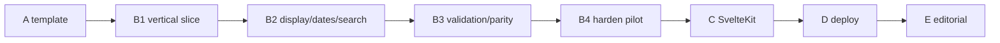
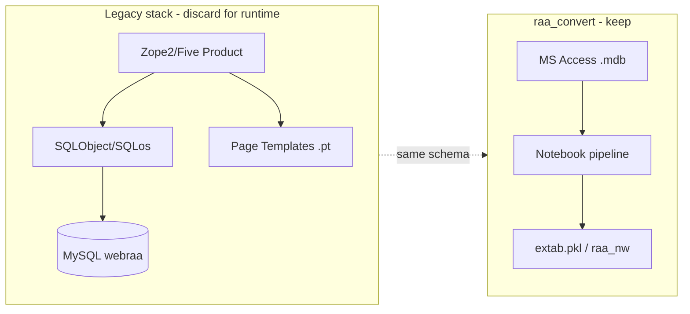
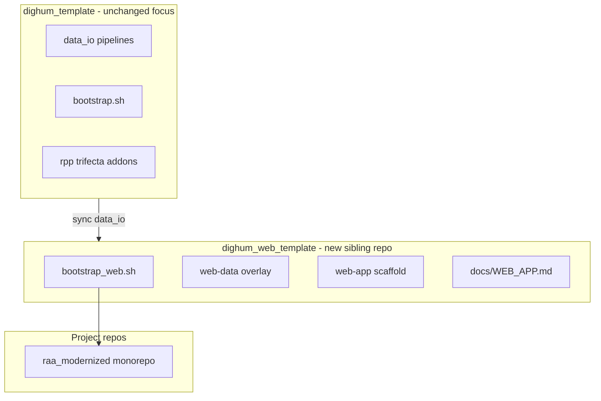
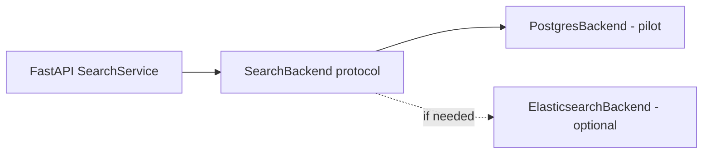
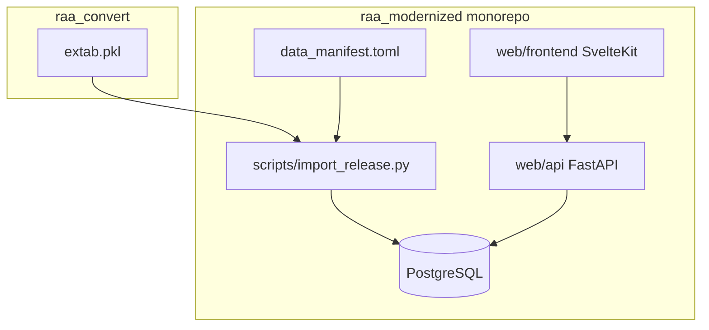
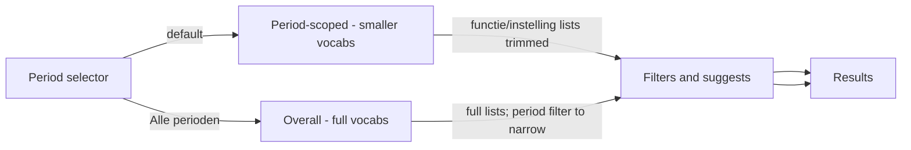
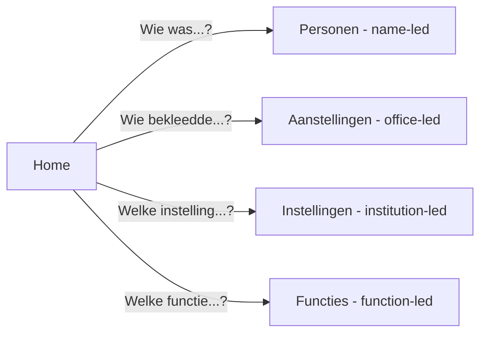
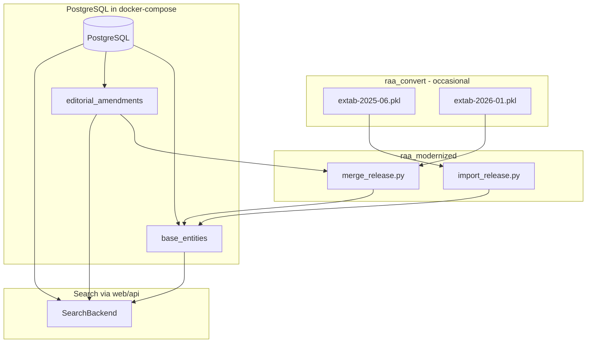

# RAA Modern Webapp Port Plan

> **Active build track:** **C** (SvelteKit UI). Static pilot kept until **beta** (C4 deferred).  
> **Roadmap:** [Milestones](#milestones-roadmap) · **Todos:** [checklist](#todos-living-checklist) · **Decisions:** [docs/MIGRATION_LOG.md](docs/MIGRATION_LOG.md) · **Legacy UX:** [LEGACY-UX.md](LEGACY-UX.md)

### Current status (2026-08-16)


| Area             | State                                                                                                                                                          |
| ---------------- | -------------------------------------------------------------------------------------------------------------------------------------------------------------- |
| Phase 0 template | `dighum_web_template` bootstrapped                                                                                                                             |
| Data import      | `extab.pkl` → Postgres; shadow life dates + `search_display` + entity spans                                                                                    |
| Search store     | **PostgreSQL pilot** — ES deferred                                                                                                                             |
| API              | Four contexts + suggest + detail + A–Z browse + expanded personen facets                                                                                         |
| UI               | Static pilot + SvelteKit (`web/ui/`); personen = **basic search + facet sidebar**                                                                              |
| Validation       | X1–X5 automated PASS; ID sample corrected (Huygens 6448 → pilot **21510**); Legacy hit counts still open                                                       |


Update [docs/MIGRATION_LOG.md](docs/MIGRATION_LOG.md) when decisions or shipped work change.

## Milestones roadmap

Active track is still **Milestone B** (Postgres search pilot). Later letters map to Phases 3–5.


| Milestone | Goal | Status | Close gate |
| --------- | ---- | ------ | ---------- |
| **A** | Generic `dighum_web_template` smoke (bootstrap → import → facet API) | **done** | Template bootstraps; sample search works |
| **B1** | RAA vertical slice: import `extab.pkl`, four contexts, period modes, person detail | **done** 2026-07-12 | Facet latency OK; wildcard smoke OK → Postgres committed |
| **B2** | Display names, shadow/EDTF life dates, entity detail/spans, `search_display` | **shipped** 2026-07-13/14 | See slices B2a–B2f below |
| **B3** | Historian validation + remaining legacy parity | **parity shipped**; matrix open | B3a–e done; fill [VALIDATION_RQS.md](docs/VALIDATION_RQS.md) Legacy/Verdict; B3f backlog OK |
| **B4** | Pilot hardening for shared use | **in progress** | `dev.sh` + `make check-db`; B4b after Huygens matrix |
| **C** | SvelteKit UI (replace static HTML/JS pilot) | **in progress** (C1–C2) | `web/ui/`; C3 detail next |
| **D** | Deploy read-only public pilot | planned (Phase 4) | Managed Postgres + API + static/SvelteKit; CI smoke |
| **E** | Editorial amendments (toelichting first) | planned (Phase 5) | Edit → amendment table → search reflects; re-import merge without losing edits |



**Now:** fill the [VALIDATION_RQS.md](docs/VALIDATION_RQS.md) Legacy/Verdict columns (B3a–e shipped). Then **B4**. Do not start SvelteKit (**C**) until B3 close gate passes.

## Todos (living checklist)

Check items off here when shipped; log decisions in [MIGRATION_LOG.md](docs/MIGRATION_LOG.md).

### Now — B3

- [ ] Fill Legacy **hit-count** cells in [docs/VALIDATION_RQS.md](docs/VALIDATION_RQS.md) (interactive Huygens forms) — **human, async OK**
- [x] Run `uv run python scripts/validation_rq_smoke.py` and refresh pilot baselines if data changed
- [x] **B3d** — aanstellingsdatum range filter on personen search
- [x] **B3e** — A–Z browse UI (`GET /api/browse/{entity}/az`) on instellingen + functies
- [x] Document X1–X5 cross-cutting checks (automated in `validation_rq_smoke.py --assert`)
- [ ] Close B3 when ≥12/16 RQs have Legacy counts compared (B3f may stay backlog)

### Next — B4 / C

- [x] **B4a** — one-command local stack (`scripts/dev.sh`) — D-53
- [x] **B4b** (partial) — matrix documented + ID correction; Legacy counts async
- [x] **B4c** — `make check` / `make check-db`
- [x] **B4d** — baselines locked in `--assert`
- [x] **C1** — SvelteKit scaffold against existing FastAPI contracts (`web/ui/`)
- [x] **C2** — four contexts + period + typeahead/chips + A–Z
- [x] **C2a** — personen hybrid UI: basic `q` + live facet sidebar + advanced filters (D-60)
- [x] **C2b** — hybrid aanstellingen (+ facets); themed instellingen/functies browse
- [x] **C3** — SvelteKit detail pages (persoon / instelling / functie) with theme
- [ ] **C4** — retire static pilot (**deferred until beta**; keep `/static/` alongside SvelteKit for now)

### Backlog (blocked or low priority)

- [ ] **B3f** — legacy Huygens → modern ID concordance table + lookup/redirect — D-58 (needs user’s mapping file)
- [ ] `instelling_functie_span` mirror table (optional; B2e noted as v1 optional)
- [ ] pg_trgm / better ranking on `search_display` if ILIKE feels slow
- [ ] Sanitize HTML on `toelichting` before public deploy

### Deferred (explicit non-goals for B3/B4)

- [ ] Period-specific shadow life offsets (ME / Republiek / Bataafs-Frans / 19e eeuw)
- [ ] Role-specific birth offset (e.g. gedeputeerde −44 yr)
- [ ] EDTF on aanstellingen zittingstermijn
- [ ] Move EDTF derivation upstream into `raa_convert`
- [ ] Elasticsearch backend (only if Postgres search pain reappears)
- [ ] SvelteKit UI (**Milestone C**) — after B4
- [ ] Public deploy (**Milestone D**) — after C or B4+static
- [ ] Editorial amendments (**Milestone E / Phase 5**) — toelichting first

### Done (recent)

- [x] **B2a–B2e** — display names, shadow/EDTF, detail, entity spans
- [x] **B2f** — `search_display` shadow identity blob + search wiring + backfill
- [x] **B3a–B3e** — pagination, sort, stand/adel, aanstellingsdatum on personen, A–Z browse
- [x] Expand personen `q` beyond `searchable` / voornaam / geslachtsnaam

---

## What you have today




| Layer        | Legacy `[src/raa](file:///Users/rikhoekstra/develop/RepertoriumAmbtenarenAmbtsdragers/src/raa)`                                                                                                               | Modern replacement                                                                                                                    |
| ------------ | ------------------------------------------------------------------------------------------------------------------------------------------------------------------------------------------------------------- | ------------------------------------------------------------------------------------------------------------------------------------- |
| Runtime      | Python 2, Zope 2/3, SQLObject                                                                                                                                                                                 | Python 3.12, FastAPI                                                                                                                  |
| Search store | MySQL + SQLObject queries                                                                                                                                                                                     | **TBD after Milestone B** — Postgres SQL facets (default pilot) or Elasticsearch; see [Search store decision](#search-store-decision) |
| UI           | Server-rendered `.pt` templates                                                                                                                                                                               | SvelteKit **hybrid**: basic search + live facet sidebar (+ advanced filters)                                                          |
| Search logic | `[query.py](file:///Users/rikhoekstra/develop/RepertoriumAmbtenarenAmbtsdragers/src/raa/query.py)` + `[form.py](file:///Users/rikhoekstra/develop/RepertoriumAmbtenarenAmbtsdragers/src/raa/browser/form.py)` | Backend-agnostic query builder; legacy wildcard semantics preserved                                                                   |
| Data source  | ETL → MySQL                                                                                                                                                                                                   | `[raa_convert](file:///Users/rikhoekstra/develop/raa_convert)` → `extab.pkl` → Postgres import (pilot) or ES index                    |
| Period model | Not in legacy search UI                                                                                                                                                                                       | **Top-level period facet** + **overall (all-period) search**                                                                          |


**Data ready for the webapp** (`[raa_convert/extab.pkl](file:///Users/rikhoekstra/develop/raa_convert/extab.pkl)`): 14 tables, ~22k persons, ~54k appointments, ~535 institutions. Schema documented in `[data_definitions.py](file:///Users/rikhoekstra/develop/raa_convert/data_definitions.py)` and validated by `[validate_export.py](file:///Users/rikhoekstra/develop/raa_convert/validate_export.py)`.

**Feature surface to replicate** (from `[browser/configure.zcml](file:///Users/rikhoekstra/develop/RepertoriumAmbtenarenAmbtsdragers/src/raa/browser/configure.zcml)`):

- Search/browse: **personen**, **aanstellingen**, **instellingen**, **functies**
- **Period-scoped search** per source period + **overall search** across all periods
- **Faceted search**: period, functie, instelling, provincie, regio, lokaal, stand, adel, titles, date ranges — with live facet counts
- Detail pages: person (aliases, appointments split local/supra-local, bronnen), institution (HTML `toelichting`), appointment, function
- Legacy search capabilities to preserve: wildcard text (`*`/`?`, quoted phrases), multi-select AND/OR, sortable columns, pagination (20), appointment grouping
- Optional later: institution `toelichting` editing (was TinyMCE + Zope admin in legacy) — **Phase 5 editorial layer**

**Do not port:** Zope product wiring, FiveSQLOS traversable containers, SQLObject, bundled TinyMCE 2.x, legacy ETL in `RepertoriumAmbtenarenAmbtsdragers/src/scripts/` (superseded by `raa_convert`).

---


## Phase 0 — `dighum_web_template` (sibling derivative repo)

`dighum_template` should stay **pipeline-only** (`[data_io](file:///Users/rikhoekstra/develop/dighum_template/packages/data_io/)`, notebooks, manifests, addons like `rpp`). Web search apps are a different purpose — embedding FastAPI, Postgres, SvelteKit scaffolds inside it would clutter the template.

**Create a separate sibling repo:** `dighum_web_template` — a **derivative** of `dighum_template`, not a folder inside it.

### Repo relationship




| Repo                  | Role                         | Stays clean of                  |
| --------------------- | ---------------------------- | ------------------------------- |
| `dighum_template`     | DH pipeline bootstrap        | Web stacks, Postgres, SvelteKit |
| `dighum_web_template` | Web-app bootstrap derivative | Domain data (RAA, RPP, …)       |
| `raa_modernized`      | RAA monorepo (data + web)    | Template maintenance            |


`bootstrap_web.sh` supports `--monorepo` (default for RAA): one repo with pipeline root + `web/` subfolder, instead of `{name}-data` + `{name}-web` siblings.

### How the derivative stays in sync

- **Vendor** `data_io`**:** copy or `sync_data_io.sh`-style script pointing at `../dighum_template/packages/data_io`
- **Monorepo mode (**`--monorepo`**):** bootstrap pipeline root via upstream `bootstrap.sh` into target dir, merge `overlay/web-data/`, copy `template/web-app/` → `web/`
- **Sibling mode (default for generic projects):** creates `{name}-data` + `{name}-web` with `bridge.local.toml`
- **Upstream updates:** periodic re-sync from `dighum_template` main


### Minimal touch on `dighum_template` itself

Only a **pointer**, not web code:

- One paragraph in `[docs/NEW_REPO.md](file:///Users/rikhoekstra/develop/dighum_template/docs/NEW_REPO.md)` or `[addons/README.md](file:///Users/rikhoekstra/develop/dighum_template/addons/README.md)`: "For search/browse webapps, use sibling `[dighum_web_template](../dighum_web_template)`"
- Optional portable wisdom topic in `dighum_template/wisdom/topics/web-app-bridge.md` (architecture only, no scaffolds) — or keep all web docs solely in the derivative


### New artifacts in `dighum_web_template`


| Artifact                       | Purpose                                                                                                        |
| ------------------------------ | -------------------------------------------------------------------------------------------------------------- |
| `scripts/bootstrap_web.sh`     | Creates monorepo (`--monorepo`) or sibling `{name}-data` + `{name}-web`                                        |
| `overlay/web-data/`            | Files merged into data repo: `scripts/import_release.py` template, manifest snippet                            |
| `template/web-app/`            | FastAPI + `SearchBackend`, SvelteKit stub, `docker-compose.yml`, `bridge.toml.example`, `search_contexts.yaml` |
| `docs/WEB_APP.md`              | Bootstrap, bridge wiring, dev stack, deploy                                                                    |
| `AGENTS.md` / `.cursor/rules/` | Web-app agent standards                                                                                        |
| `README.md`                    | States derivative relationship + sync instructions                                                             |


### Bootstrap command (target UX)

```bash
cd ~/develop/dighum_web_template
./scripts/bootstrap_web.sh ~/develop/raa_modernized raa-modernized --monorepo
# Creates:
#   ~/develop/raa_modernized/     — monorepo: pipeline root + web/ subfolder
```

Requires `dighum_template` as sibling. Optional: `--with-wisdom`, `--addon <name>` for pipeline layer.

### Monorepo layout (`raa_modernized`)

```
raa_modernized/
├── data_io/                 # vendored from dighum_template
├── data_manifest.toml
├── scripts/
│   └── import_release.py    # extab.pkl → Postgres
├── notebooks/
├── web/
│   ├── api/                 # FastAPI + SearchBackend
│   ├── frontend/            # SvelteKit
│   ├── search_contexts.yaml
│   └── docker-compose.yml   # Postgres + API + frontend
├── config.local.toml        # DB URL etc. (gitignored; no cross-repo bridge)
├── pyproject.toml
└── AGENTS.md
```

Pipeline and web share one git repo; `config.local.toml` replaces `bridge.local.toml` (internal paths only).

### Config contract (`config.local.toml`) — monorepo

```toml
[database]
url = "postgresql://localhost/raa_modernized"

[web]
api_port = 8000
frontend_port = 5173

[data]
extab_logical = "raa_extab"   # manifest logical name

# Optional — only if decision gate chooses ES:
# [elasticsearch]
# url = "http://localhost:9200"
```

For **sibling-repo** projects (non-RAA), `bridge.toml` still links separate data + web repos. RAA uses monorepo config only.

### Web scaffold conventions (reusable defaults)

These become the **standard DH web stack** in the derivative — RAA customizes on top:


| Layer              | Default choice                                  | Rationale                                                |
| ------------------ | ----------------------------------------------- | -------------------------------------------------------- |
| API                | FastAPI + SQLAlchemy 2 + Pydantic               | Python 3.12; `SearchBackend` protocol with Postgres impl |
| Data store         | PostgreSQL (pilot)                              | Facets via SQL, editorial-ready, one service             |
| Search abstraction | `SearchBackend` protocol                        | Swap to ES after Milestone B if needed                   |
| Frontend           | SvelteKit + facet sidebar                       | Backend-agnostic facet UI                                |
| Dev                | `docker compose up` (Postgres + API + frontend) | Simpler than ES for pilot                                |


**Not in v1 of the derivative:** auth, CMS editing, Observable dashboards (separate bridge doc).

### Relationship to Observable bridge


| Pattern                          | Repo                    | Use when                                    |
| -------------------------------- | ----------------------- | ------------------------------------------- |
| **Pipeline template**            | `dighum_template`       | Data pipelines, notebooks, MCP              |
| **Web-app template**             | `dighum_web_template`   | Search/browse apps with bridge to data repo |
| **Observable bridge** (deferred) | separate dashboard repo | Exploratory charts only                     |


---


## Recommended repository model (RAA)

**Single monorepo:** `[raa_modernized](file:///Users/rikhoekstra/develop/raa_modernized)` — bootstrapped via `dighum_web_template/scripts/bootstrap_web.sh --monorepo`.


| Part                | Path in repo | Responsibility                                       |
| ------------------- | ------------ | ---------------------------------------------------- |
| **Data / pipeline** | repo root    | Manifest, `import_release.py`, validation, `data_io` |
| **Web**             | `web/`       | Search API, RQ-driven UI, deployment                 |


`raa_convert` stays the **upstream conversion lab**; `raa_modernized` consumes its outputs via manifest (`raa_extab`).

---


## Search store decision

**Status: PostgreSQL pilot committed (2026-07-12).** Milestone B validation passed (facet latency ~23ms, wildcard checks OK). Elasticsearch remains a documented escape hatch only if search pain reappears at scale — see [docs/MIGRATION_LOG.md](docs/MIGRATION_LOG.md) D-10, D-11.

### Comparison at RAA scale (~22k persons, ~54k appointments)


| Criterion                     | PostgreSQL + SQL facets                                             | Elasticsearch                              |
| ----------------------------- | ------------------------------------------------------------------- | ------------------------------------------ |
| **Facet counts**              | `GROUP BY` per dimension (post-filter pattern) — fast at this scale | Native aggregations — very ergonomic       |
| **Full-text / wildcards**     | `pg_trgm`, `ILIKE`, or app-layer `query.py` port                    | Strong analyzers, `query_string`           |
| **Relational detail pages**   | Natural JOINs                                                       | Denormalized docs or second lookup         |
| **Editorial layer (Phase 5)** | Same database — no sync                                             | Needs Postgres anyway + ES sync            |
| **Ops complexity**            | One service (already in plan)                                       | ES cluster + index rebuild + sync          |
| **Appointment grouping**      | SQL `GROUP BY` fits well                                            | `terms` agg — works, less familiar         |
| **Re-import on new extab**    | Merge into base tables                                              | Reindex from merged export                 |
| **Scale headroom**            | Fine to ~low millions with indexes                                  | Better if 10×+ growth or heavy text search |
| **Debuggability**             | SQL you can inspect                                                 | JSON queries, mapping tuning               |


### Recommendation

For RAA specifically, **PostgreSQL is likely the long-term winner** because Phase 5 editorial storage needs it anyway, the dataset is small, and legacy search maps cleanly to SQL filters. Elasticsearch is worth it if Milestone B shows pain on wildcard name search, facet latency with many concurrent filters, or Dutch text relevance.

### Pilot strategy (your choice: decide later)




1. **Milestone B** ships with `PostgresBackend` only — validates data model, facets, period modes, UI
2. **Decision gate** — measure:
  - Person search p95 latency with 3+ active facets
  - Wildcard query correctness vs legacy `query.py` test cases
  - Developer ergonomics (SQL complexity)
3. **Commit** to Postgres (remove ES path) **or** add ES as read projection synced from Postgres

**Do not maintain both in production** — pick one after the gate to avoid permanent dual-sync tax.

### SQL facet pattern (Postgres pilot)

For each facet dimension, run a count query with **all active filters except that dimension** (same semantics as ES `post_filter`):

```sql
-- Example: functie facet counts given current filters
SELECT f.id, f.naam, COUNT(DISTINCT p.id)
FROM persoon p
JOIN aanstelling a ON ...
JOIN functie f ON ...
WHERE <period + text + other facets, NOT functie>
GROUP BY f.id, f.naam
ORDER BY count DESC
LIMIT 50;
```

Period flags: boolean columns per period on base tables, or `period_membership(entity_type, entity_id, period)` junction table.

---


## Architecture target (pilot: PostgreSQL)




**Optional ES path (if decision gate chooses it):** Postgres remains canonical; `build_search_index.py` projects to ES for search only; editorial amendments sync to both.

---


## Search model: period division + overall search


### Why period separation exists

Period division serves **two goals**:

1. **Historical coherence** — institutions, offices, and geography differ across eras; mixing them blurs meaning.
2. **Facet / filter clutter reduction** — the main UX reason. A single cross-period index inflates vocabularies: many functies and instellingen only exist in one period. Scoping to e.g. **Republiek** shrinks every filter list and suggest result to **entities that actually occur in that period**, making typeahead, browse A–Z, and small-set checkboxes tractable.

Overall ("Alle perioden") search remains available for **cross-period RQs**, but is the **noisier mode** — users accept broader vocabularies and may need period as an explicit filter to narrow.

**Default:** period-scoped on entry (recommended path); overall is opt-in.

### Period data (from `raa_convert`)

Each export row carries period flags (`1` = included in that period's search), documented in `[CONVERSION_NOTES.md](file:///Users/rikhoekstra/develop/raa_convert/docs/CONVERSION_NOTES.md)`:


| Period key         | Label (NL)                                                                                                      |
| ------------------ | --------------------------------------------------------------------------------------------------------------- |
| `republiek`        | Republiek (incl. Friezen — shares `pmap` value; derive `republiek_friezen` at index time where distinguishable) |
| `batfra`           | Bataafs-Franse Tijd                                                                                             |
| `negentiende_eeuw` | Negentiende Eeuw                                                                                                |
| `me`               | Middeleeuwen                                                                                                    |
| `divperioden`      | Diverse Perioden                                                                                                |


At index time, convert boolean flags → `periods: ["republiek", "batfra"]` keyword array on every document.

### Two search modes (single app)


| Mode                        | UI                                            | Query behavior                                                                                | Filter clutter                         |
| --------------------------- | --------------------------------------------- | --------------------------------------------------------------------------------------------- | -------------------------------------- |
| **Period-scoped** (default) | User picks one period from top-level selector | Filter `period = <selected>`; all suggests/browse/lists scoped to that period's entities only | **Low** — primary mode                 |
| **Overall**                 | "Alle perioden" in same selector              | No period filter; period available as filter to drill down                                    | **High** — opt-in for cross-period RQs |


Period scope applies **globally** to every search context (personen, aanstellingen, …) and to `/api/suggest` and `/api/browse` — not only to main search results.




### Filters and facets — depends on the research question

There is no single "best" filter layout. A repertorium serves **different research questions (RQ)**; the UI should match **how the user enters the question**, not impose one global facet sidebar.

**Design principle:** keep **four separate search contexts** from the legacy app (personen, aanstellingen, instellingen, functies). Each page exposes **only the filters relevant to that RQ** — configured in `search_contexts.yaml`, not hardcoded tiers.

#### Typical research questions → entry path


| Research question                              | Start at         | Period mode       | Why                               |
| ---------------------------------------------- | ---------------- | ----------------- | --------------------------------- |
| "Who held office Y at Z in the **Republiek**?" | `/aanstellingen` | **Scoped**        | Smaller functie/instelling vocab  |
| "Who was person X?" (any period)               | `/personen`      | Overall or scoped | Name search; period optional      |
| "Compare office holders across periods"        | `/aanstellingen` | **Overall**       | Cross-period RQ — accepts clutter |
| "What institutions in period P?"               | `/instellingen`  | **Scoped**        | Browse list stays bounded         |


Home page (`/`) offers **"Waar wilt u mee beginnen?"** plus period selector — choosing a period first keeps subsequent filters manageable.




#### Filter widget types (implementation, not UX driver)

Choose widget **per field per search context** based on cardinality + how users approach that RQ:


| Widget                   | Use when                         | Sort / order                       |
| ------------------------ | -------------------------------- | ---------------------------------- |
| **Full list** (checkbox) | Small closed set in this context | Alphabetical (nl_NL)               |
| **Typeahead**            | User knows (part of) the name    | Alphabetical matches, not by count |
| **Browse A–Z**           | User is exploring, no name yet   | Alphabetical pages                 |
| **Free text**            | Legacy-style "contains" on naam  | N/A                                |
| **Date range**           | Temporal RQ                      | N/A                                |


**Counts:** show as optional scope hints ("42 treffers") — never use count to rank or promote options.

**Do not:** one sidebar with every dimension on every page; top-N by popularity; assume bigger = more searched.

#### Per-context filter sets (defaults — tune with user testing)


| Context           | Prominent                                       | In advanced / on demand                                        |
| ----------------- | ----------------------------------------------- | -------------------------------------------------------------- |
| **Personen**      | naam, period                                    | stand, adel, geo, functie/instelling lookup, birth/death dates |
| **Aanstellingen** | functie + instelling lookup, period, date range | geo, stand, grouping by instelling/functie                     |
| **Instellingen**  | naam (browse/typeahead), period                 | —                                                              |
| **Functies**      | naam (browse/typeahead), period                 | —                                                              |


Users add dimensions as needed (progressive disclosure) — most RQs need 1–3 filters, not all eight.

#### API support

- `search_contexts.yaml` — defines which filters appear per `entity` + widget type
- `GET /api/suggest/{field}` — alphabetical typeahead; **respects period scope** (returns only entities with appointments/records in that period)
- `GET /api/browse/{entity}/az` — A–Z catalog; **period-scoped by default**
- Same `SearchBackend` underneath; only exposed filters change per context

Legacy AND/OR multi-select: per filter group where multiple values apply; same semantics as `[query.py](file:///Users/rikhoekstra/develop/RepertoriumAmbtenarenAmbtsdragers/src/raa/query.py)`.

**Validate in Milestone B3:** run the historian matrix in [VALIDATION_RQS.md](docs/VALIDATION_RQS.md); adjust filters before declaring B3 closed.

### Milestone B3 — Historian validation (in progress)

**Matrix:** [docs/VALIDATION_RQS.md](docs/VALIDATION_RQS.md) — 16 RQs (4 per search context) + 5 cross-cutting checks.

**Workflow**

1. Legacy Huygens vs pilot (`127.0.0.1:8000`) — fill **Legacy** / **Verdict** columns in the matrix.
2. Refresh pilot baselines: `uv run python scripts/validation_rq_smoke.py` (from repo root).
3. Log outcomes in [MIGRATION_LOG.md](docs/MIGRATION_LOG.md); failed RQs become B3 parity tasks.

**Seed RQs (summary)**


| Context           | Examples                                                                                                  |
| ----------------- | --------------------------------------------------------------------------------------------------------- |
| **Personen**      | Aylva / `Tjaerd baron van Aylva` via `search_display`; geboorte `1700/1750` (+ exact-dates toggle); gedeputeerde × Gedeputeerde Staten van Friesland |
| **Aanstellingen** | Same office pair nested; burgemeester + provincie; cross-period schout                                    |
| **Instellingen**  | Staten van Friesland; `*raad`* browse; rekenkamer toelichting                                             |
| **Functies**      | gedeputeerde variants; raadspensionaris spans (B2e); personen deep link                                   |


**Close gate:** ≥12/16 RQs pass + cross-cutting **X1–X5** documented → B3 validation complete (then B4).

### Milestone B3 — Parity closure (in progress)


| Slice   | Scope                                                                                                                          | Status                     |
| ------- | ------------------------------------------------------------------------------------------------------------------------------ | -------------------------- |
| **B3a** | Pagination (vorige/volgende, 100/page) on all four search pages                                                                | **shipped** 2026-07-13     |
| **B3b** | Sort toggles: personen column headers; aanstellingen sort dropdown                                                             | **shipped** 2026-07-13     |
| **B3c** | Stand + adel filters (API + UI checkboxes); `GET /api/stands`                                                                  | **shipped** 2026-07-13     |
| **B3d** | Aanstellingsdatum range on personen (legacy had separate filter)                                                               | **shipped** 2026-07-17 |
| **B3e** | Browse A–Z (`GET /api/browse/{entity}/az`) in instellingen/functies UI                                                         | **shipped** 2026-07-17 |
| **B3f** | **Legacy ID concordance** — map Huygens entity numbers → modern `raa.*.id`; redirect or lookup (user has source concordance) | **backlog** — D-58         |


**B3f — legacy ID concordance (backlog)**

Huygens public IDs ≠ pilot `persoon.id`. Known example: legacy **6448** → pilot **21009** (Tjaerd van Aylva). Do not use Huygens IDs in pilot deep links until concordance is imported. When ready: auxiliary mapping table at import + lookup/redirect (personen first).

Later (no priority): provide a **silent legacy-ID person lookup** endpoint (`/personen/oud/{legacy_id}`) that redirects to the normal modern detail page, without showing legacy IDs anywhere else in the UI.

### Milestone B4 — Pilot hardening (**in progress**)

| Slice   | Scope | Status |
| ------- | ----- | ------ |
| **B4a** | One-command local stack (`scripts/dev.sh`: Postgres + import-if-empty + API; compose or legacy `raa_pg`) | **shipped** 2026-08-16 (D-53) |
| **B4b** | Documented historian validation pass (filled [VALIDATION_RQS.md](docs/VALIDATION_RQS.md) + MIGRATION_LOG entry) | open (needs Huygens fill) |
| **B4c** | `make check` (unit) + `make check-db` / `validation_rq_smoke.py --assert` (RQ + X1–X5) | **shipped** 2026-08-16 |
| **B4d** | Fix P0 search/display bugs found during B3 (no feature creep) | **shipped** — baselines locked; reopen if matrix finds P0 |

**Close gate:** a second person can clone, run `dev.sh`, and reproduce the validation matrix without ad-hoc docker/cwd notes; Huygens Legacy columns filled.
### Milestone C — SvelteKit UI (Phase 3, **in progress**)

| Slice | Scope | Status |
| ----- | ----- | ------ |
| **C1** | Scaffold SvelteKit (`web/ui/`) against existing FastAPI; home + personen search stub | **shipped** 2026-08-16 |
| **C2** | Port four search contexts + period selector + typeahead/chips + A–Z browse | **shipped** 2026-08-16 |
| **C3** | Port detail pages (persoon / instelling / functie) | open |
| **C4** | Retire static HTML/JS pilot | **deferred until beta** (both UIs for now) |

Run: API via `./scripts/dev.sh`, UI via `cd web/ui && npm install && npm run dev` → http://127.0.0.1:5173

### Milestone D — Deploy read-only (Phase 4)

| Slice | Scope | Status |
| ----- | ----- | ------ |
| **D1** | Managed Postgres + Gunicorn/Uvicorn API | planned (D-54) |
| **D2** | Static or SvelteKit front behind reverse proxy | planned |
| **D3** | CI: import smoke + API health | planned |

### Milestone E — Editorial (Phase 5)

| Slice | Scope | Status |
| ----- | ----- | ------ |
| **E1 / 5a** | Edit `instelling.toelichting` → `editorial_amendments` | planned |
| **E2 / 5b** | `opmerkingen` on persoon/aanstelling | planned |
| **E3 / 5c** | Core fields + conflict review on re-import | planned |
| **E4 / 5d** | Create new records (web-only IDs) | planned |

### Milestone B2 — Display, dates, identity search (**shipped**)

Enhancements **above** legacy Huygens UX. Decision register: [docs/MIGRATION_LOG.md](docs/MIGRATION_LOG.md) D-37–D-39, D-55–D-57, D-59.


| Slice   | Scope                                                                                                                                                                                      | Status                 |
| ------- | ------------------------------------------------------------------------------------------------------------------------------------------------------------------------------------------ | ---------------------- |
| **B2a** | `display_naam` / `listing_naam` API + JS; sort `coalesce(geslachtsnaam, voornaam)`; no leading comma for 51 voornaam-only persons                                                          | **shipped** 2026-07-13 |
| **B2b** | `scripts/shadow_life.py` + import columns; EDTF derivation from parts/`onbepaald`* flags; `edtf_bounds.py` overlap SQL; `include_shadow_dates` on search (default `true`)                  | **shipped** 2026-07-13 |
| **B2c** | Personen UI: EDTF interval inputs (geboorte/overlijden); radio **“zoek exacte datums”** (shadow off); provenance badges (`~`, *geschat*)                                                   | **shipped** 2026-07-13 |
| **B2d** | Person detail parity: legacy `naam()`, heerlijkheid, opmerkingen, bronnen, life summary, appointment opmerkingen; shared `entity_profile` for functie/instelling detail                    | **shipped** 2026-07-13 |
| **B2e** | Import-time **entity span** auxiliary tables (`functie_instelling_span`, `functie_attestation`); functie profile shows corpus first/last + per-institution contexts                         | **shipped** 2026-07-13 |
| **B2f** | **Shadow `search_display`** — import-time identity blob (display naam + titels + alias + heerlijkheid + opmerkingen + legacy `searchable`); personen/`aanstellingen` `q` matches it first | **shipped** 2026-07-14 |


**B2f — searchable shadow display name**

Legacy `searchable` is often surname-only (e.g. `"van Aylva"`), so queries like `Tjaerd baron van Aylva` failed: `baron` lives in `opmerkingen`, not name columns. Fix:

- Package `raa_search_display/`: shared `format_persoon_naam` / `format_persoon_listing_name` + `enrich_persoon_search_display`.
- Column `persoon.search_display` written at import; index `idx_persoon_search_display`.
- Search prefers `search_display`; falls back to per-field OR (including alias/titles/opmerkingen) if column is null.
- Existing DB without re-import: `uv run python scripts/backfill_search_display.py`.

**B2e — entity spans (shipped)**

Derived at import (like shadow life dates), not in `extab.pkl`. Labels are **earliest/latest dated aanstelling in the database** — not claims about when an office was invented or abolished in the real world.


| Table                     | Grain                         | Purpose                                                                              |
| ------------------------- | ----------------------------- | ------------------------------------------------------------------------------------ |
| `functie_instelling_span` | `(functie_id, instelling_id)` | `min(van)` / `max(tot)`, counts, witness `aanstelling_id`s per institutional context |
| `functie_attestation`     | `functie_id`                  | Rollup: corpus-wide first/last + `instelling_count`                                  |
| `instelling_functie_span` | `(instelling_id, functie_id)` | Mirror for instelling detail (optional in v1)                                        |


**Caveats (must surface in UI copy)**

1. **Witness wording** — “vroegste / laatste **gedateerde aanstelling in het bestand**”.
2. **Institutional view vs flat rows** — the corpus is edited from an institutional perspective, yet `instelling` rows are not versioned and there is **no succession FK** between e.g. Republiek and Bataafs-Franse successors. The same historical institution may appear as **multiple** `instelling_id`**s**; a gap between context rows may reflect regime re-keying or incomplete dating, not necessarily that the office ceased to exist.
3. **No inferred continuity** — do not merge contexts or fill gaps into one “ambtsketen”. Profile shows separate context rows; gaps stay visible. Pointer: **institutionele toelichting** on the instelling detail page + [zoekhulp](https://resources.huygens.knaw.nl/repertoriumambtsdragersambtenaren1428-1861/zoekhulp) for how institutions are modelled.

Build: `raa_entity_spans/` + hook in `import_release.py`. Rows with null `van`/`tot` excluded from min/max; tie-break on lowest `aanstelling.id`.

**B2b — shadow life dates (shipped)**

Port `hypothetical_life` from `republic_clean/republic/data/datamangler.py`:

- Appointment span per person: `min(van)` / `max(tot)` using `pd.Period(freq="D")` (not `Timestamp` before 1678).
- No recorded birth → `life_start_year = min(van).year − 34`.
- No valid death → `life_end_year = max(tot).year + 22` (if death ≤ birth, apply padding rule).
- Source columns: `life_start_source`, `life_end_source` ∈ `recorded` \| `shadow` \| `partial`.

**Search semantics**

- Default: overlap query uses full life interval (recorded + shadow fill).
- **“zoek exacte datums”** selected: overlap uses **recorded** bounds only.
- Aanstellingen `van`/`tot`: ISO `YYYY-MM-DD` in v1 (maps to EDTF Level 0).

**EDTF (personen, Level 1 subset)**

- Storage: `geboorte_edtf`, `overlijden_edtf`, `life_start_edtf`, `life_end_edtf` (text).
- Query examples: `1720/1750`, `../1720`, `1720/..`, `1720~`, `1720?`.
- Spec: [LOC EDTF](https://www.loc.gov/standards/datetime/).

**Explicit TODO** — kept in the [living checklist](#todos-living-checklist) (Deferred). Local copies:

- [ ] Period-specific shadow offsets (ME / Republiek / Bataafs-Frans / 19e eeuw).
- [ ] Role-specific birth offset (e.g. gedeputeerde −44 yr, as in datamangler).
- [ ] EDTF on aanstellingen zittingstermijn.
- [ ] Move EDTF derivation upstream into `raa_convert` (optional; import-time is canonical for now).


## Phase 1 — Data import (`raa_modernized` repo root)

1. Bootstrap: `dighum_web_template/scripts/bootstrap_web.sh ~/develop/raa_modernized raa-modernized --monorepo`
2. Register datasets in `data_manifest.toml`:
  - `raa_extab` → logical path to `raa_convert/extab.pkl` (via `data_manifest.local.toml`)
  - `web_db` → Postgres connection / release tag
3. Add `scripts/import_release.py`:
  - Load `extab.pkl` (reuse loader from `[validate_export.py](file:///Users/rikhoekstra/develop/raa_convert/validate_export.py)`)
  - Import into normalized Postgres tables (14 entities, FK constraints, indexes)
  - Period flags → boolean columns or `period_membership` junction table
   - Key indexes: `persoon.searchable`, `persoon.search_display`, `geslachtsnaam` (pg_trgm), `aanstelling.van/tot`, FK columns
   - Tag import with `release_id` (e.g. `2025-06`) for future merge
   - **B2:** run `shadow_life.py` post-import — EDTF columns, `life_*_year` bounds, provenance sources
   - **B2:** `search_display` at import (`raa_search_display`) — shadow identity blob for personen text search; backfill `scripts/backfill_search_display.py`
4. Run existing validation (`validate_export.py`) as pre-build gate.
5. Export frozen parquet per table (optional, analytics) via `data_io.save_parquet`.

**If decision gate later chooses ES:** add `build_search_index.py` that projects from Postgres (not directly from extab) — single import path.

---


## Phase 2 — Backend API (`raa_modernized/web/api`)

Stack: **FastAPI + SQLAlchemy 2 + Pydantic +** `SearchBackend` **protocol**. Pilot: `PostgresBackend`.

### 2a. SearchBackend interface

```python
class SearchBackend(Protocol):
    async def search(self, entity: str, request: SearchRequest) -> SearchResponse: ...
    async def get_detail(self, entity: str, id: int) -> dict: ...
    async def list_periods(self) -> list[PeriodCount]: ...
```

`SearchRequest` / `SearchResponse` are backend-agnostic (hits, total, facets dict). Frontend never knows Postgres vs ES.

### 2b. Search endpoints


| Endpoint                                     | Notes                                                                                  |
| -------------------------------------------- | -------------------------------------------------------------------------------------- |
| `POST /api/search/personen`                  | Text + facets + **EDTF life-date intervals** + `include_shadow_dates` (default true)   |
| `POST /api/search/aanstellingen`             | Group-by via SQL `GROUP BY` or ES `terms` agg                                          |
| `POST /api/search/instellingen`, `/functies` |                                                                                        |
| `GET /api/{entity}/{id}`                     | Detail via JOINs (Postgres) or doc fetch (ES)                                          |
| `GET /api/periods`                           | Period labels + doc counts                                                             |
| `GET /api/suggest/{field}`                   | Typeahead for tier B/C (alphabetical, not by count); optional contextual count per hit |
| `GET /api/browse/{entity}/az`                | Paginated A–Z catalog for exploration (instelling, functie)                            |


Port `_text_search()` wildcard/quote semantics in a shared query builder (used by both backends).

Legacy AND/OR multi-select: SQL `IN` / nested subqueries (Postgres) or `bool` queries (ES).

### 2c. Facet response contract

Every search response includes `hits`, `total`, `facets` — tier A buckets only (complete lists, alphabetical). Tier B/C filters come from suggest/browse, not sidebar facet buckets.

### 2d. Tests

- Unit tests for text query builder (backend-agnostic)
- Integration tests against Postgres testcontainer (pilot)
- Regression: result counts vs legacy searches, per period and overall
- **Decision gate tests:** document p95 latency + wildcard correctness metrics

---


## Phase 3 — Frontend (`raa_modernized/web/frontend`)

**SvelteKit** with Dutch UI copy from legacy templates.

### Global chrome

- **Period selector** (always visible): scopes all contexts unless "Alle perioden"
- Nav: **four search contexts** (personen / aanstellingen / instellingen / functies) — each with its own filter set per RQ
- Home: guided entry ("Waar wilt u mee beginnen?") — not a unified facet wall


### Search page layout (varies by context)

Not one layout for all pages. Example for **aanstellingen** (office-led RQ):

```
[Period]  Personen | Aanstellingen | Instellingen | Functies
────────────────────────────────────────────────────────────
Functie: [typeahead]   Instelling: [typeahead]   Periode: [range]
[Uitgebreid ▼]  geo, stand, AND/OR
Chips: Burgemeester ×  Utrecht ×
────────────────────────────────────────────────────────────
Results (group by instelling | functie)
```

**Personen** leads with name search; **instellingen/functies** lead with browse/typeahead on naam. Sidebar facets only where the RQ calls for a small closed set (e.g. stand on personen advanced).

### Pages


| Route                                 | Notes                                          |
| ------------------------------------- | ---------------------------------------------- |
| `/`                                   | Home + period selector                         |
| `/personen`                           | Faceted search (primary v1 slice)              |
| `/personen/{id}`                      | Detail via API JOINs; local/supra-local split  |
| `/aanstellingen`                      | Faceted search + group-by institution/function |
| `/instellingen`, `/instellingen/{id}` | Faceted search + sanitized HTML toelichting    |
| `/functies`, `/functies/{id}`         | Faceted search + detail                        |


### UI components

- **SearchContextLayout** — renders filter set from `search_contexts.yaml` per page
- **FilterTypeahead**, **BrowseAZ**, **FacetCheckboxList** (small sets only), **FilterChips**
- **AdvancedPanel** — progressive disclosure per context

---


## Phase 4 — Deployment and ops


| Concern                     | Approach                                                                                                                                                                                |
| --------------------------- | --------------------------------------------------------------------------------------------------------------------------------------------------------------------------------------- |
| Local dev                   | `./scripts/dev.sh` — Postgres (compose) + import-if-empty + API; `stop` subcommand. **Uvicorn +** `--reload` for fast iteration (D-53).                                                 |
| Local dev (compose only)    | `docker compose -f web/docker-compose.yml up -d db`                                                                                                                                     |
| API runtime (stable / prod) | **Gunicorn** managing **Uvicorn workers** — e.g. `gunicorn raa_api.main:app -k uvicorn.workers.UvicornWorker -w 2 -b 0.0.0.0:8000` (D-54; add to compose service when pilot stabilizes) |
| Build                       | `uv run python scripts/import_release.py`; `web/frontend` build + API                                                                                                                   |
| Hosting                     | Managed Postgres + API container + static frontend                                                                                                                                      |
| Data updates                | Re-run convert → `merge_release.py` → refresh search (SQL or ES reindex)                                                                                                                |
| Auth                        | Public read-only for v1; editorial auth in Phase 5                                                                                                                                      |
| CI                          | Validate extab → import fixture DB → API integration tests                                                                                                                              |


---


## Phase 5 — Editorial layer (editing without re-converting)

**Problem:** `raa_convert` is a heavy, offline pipeline (MDB → merge → `extab.pkl`). Editorial fixes must not require re-running it. A full re-import should happen only when source databases change (new research, corrected MDBs) — and even then, **human corrections must survive**.

**Recommended model: immutable releases + editorial overlay + PostgreSQL**




### Three layers of truth


| Layer                    | What it is                                                                                           | Mutability                              |
| ------------------------ | ---------------------------------------------------------------------------------------------------- | --------------------------------------- |
| **Source release**       | Versioned `extab.pkl` (or parquet) from `raa_convert`, registered in manifest as `raa_extab@2025-06` | Immutable once published                |
| **Base tables**          | Postgres copy of current release (`import_batch_id` on every row)                                    | Replaced/merged on release upgrade only |
| **Editorial amendments** | Overrides keyed by `(entity_type, entity_id, field)`                                                 | Append/update by authenticated editors  |


**Read path:** `effective_value = amendment.value ?? base.value` — applied in SQL queries (and ES docs if that path is added later).

**Write path:** Edit UI → `POST /api/editorial/...` → Postgres `editorial_amendments` → search results reflect amendments immediately (same DB) or via partial reindex (if ES path chosen).

### Why PostgreSQL fits editing (and likely search)

Postgres gives amendment history, conflict detection on re-import, and — at RAA scale — SQL facets are fast enough. ES only adds value if the decision gate shows search pain.

If ES is chosen after Milestone B: Postgres stays canonical; ES becomes a read projection synced on import/edit.

### Re-import without losing edits

When a new `extab` release arrives:

1. `import_release.py` — load new snapshot to staging tables
2. `merge_release.py` — for each entity matched by stable `id` (or `[concordance_files/mapping_tables.json](file:///Users/rikhoekstra/develop/raa_convert/concordance_files/mapping_tables.json)` when IDs shift):
  - If no amendment on field → take new base value
  - If amendment exists and new value **equals** old base → amendment still valid, update base underneath
  - If amendment exists and new value **differs** → flag **conflict** for human review (do not auto-overwrite)
3. Rebuild search layer from merged state (SQL views refresh, or ES reindex if that path was chosen)

Editors never touch `raa_convert`; they only touch the amendment API.

### What is editable (phased)


| Phase  | Scope                                | Legacy parallel                                          |
| ------ | ------------------------------------ | -------------------------------------------------------- |
| **5a** | `instelling.toelichting` (rich HTML) | Only field editable in old Zope app                      |
| **5b** | `opmerkingen` on persoon/aanstelling | Low-risk text corrections                                |
| **5c** | Core fields (names, dates, FKs)      | Higher risk; needs validation + audit                    |
| **5d** | Create new records (web-only)        | New capability; IDs allocated in Postgres, indexed to ES |


Start with **5a** — matches legacy scope, highest value, lowest merge risk.

### Auth and audit

- Role-based: `viewer` / `editor` / `admin`
- Every amendment: user, timestamp, optional change note
- Optional: link amendments to `data_io` provenance sidecars in repo root
- Sanitize HTML on `toelichting` (unlike legacy TinyMCE raw storage)


### Alternative considered: file-based amendments in git

Store overrides as YAML/JSON in `editorial/` at repo root (manifest-backed). Viable for solo research; Postgres `editorial_amendments` table better for multi-editor.

### Impact on earlier phases

- **v1 (Phases 0–4):** read-only search via `PostgresBackend` pilot
- **After Milestone B:** search store decision gate
- **Phase 5:** editorial amendments in same Postgres instance
- `dighum_web_template`**:** document optional `editorial` module in web-app scaffold for future projects

---


## Effort estimate (rough)


| Phase                | Scope                                                            | Estimate  |
| -------------------- | ---------------------------------------------------------------- | --------- |
| **0 Web derivative** | New `dighum_web_template` repo + pointer in dighum_template docs | 4–6 days  |
| 1 Data import        | `import_release.py` + Postgres schema + indexes                  | 3–5 days  |
| 2 Backend API        | SearchBackend + Postgres impl, period modes, detail              | 1–2 weeks |
| 3 Frontend           | Facet-first hybrid UI, period selector, 4 search areas           | 2–3 weeks |
| 4 Deploy + polish    | Postgres hosting, CI, legacy query regression, **decision gate** | 4–6 days  |
| 5 Editorial layer    | Amendments, edit UI, re-import merge                             | 2–3 weeks |


**Total v1 (read-only, Phases 0–4):** ~6–8 weeks. **With editing (Phase 5):** ~8–11 weeks.

---


## What to reuse vs rewrite

**Reuse (reference or copy logic):**

- `[query.py](file:///Users/rikhoekstra/develop/RepertoriumAmbtenarenAmbtsdragers/src/raa/query.py)` — search semantics
- `[views.py](file:///Users/rikhoekstra/develop/RepertoriumAmbtenarenAmbtsdragers/src/raa/browser/views.py)` — name formatting, appointment splitting, bron sorting
- [`.pt` templates`](file:///Users/rikhoekstra/develop/RepertoriumAmbtenarenAmbtsdragers/src/raa/browser/templates/) — field labels, page structure, Dutch copy
- `[validate_export.py](file:///Users/rikhoekstra/develop/raa_convert/validate_export.py)` — data quality gate
- `[data_definitions.py](file:///Users/rikhoekstra/develop/raa_convert/data_definitions.py)` — schema truth

**Rewrite from scratch:**

- All Zope/Five/SQLObject integration
- Container/traversal model (`[container.py](file:///Users/rikhoekstra/develop/RepertoriumAmbtenarenAmbtsdragers/src/raa/container.py)`)
- MySQL-specific patches (`[monkey.py](file:///Users/rikhoekstra/develop/RepertoriumAmbtenarenAmbtsdragers/src/raa/monkey.py)`)

---


## Suggested next work

See the [Todos checklist](#todos-living-checklist) for the authoritative open list.

**Immediate:** C3 (SvelteKit detail pages). Legacy hit counts in VALIDATION_RQS remain async.  
**Then:** graphs (D-UI-14) or deploy prep; **C4** (retire static) waits until **beta**.  
**Later:** D deploy · E editorial.

