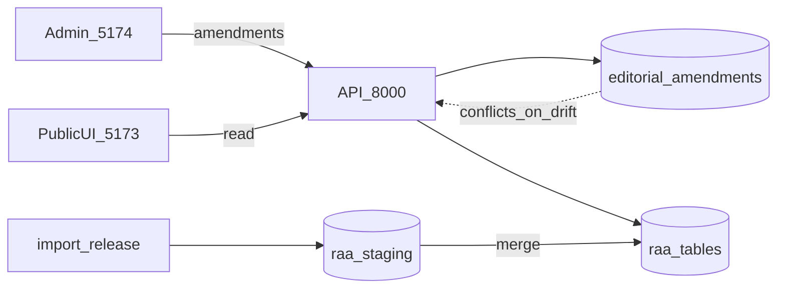

# Editorial demo — checklist for co-workers

**~15 min walkthrough** of Milestone E (redactielaag). Technical reference: [EDITORIAL.md](EDITORIAL.md).

## Pitch (30 sec)

We have two web apps:

- **Public UI** (port 5173) — search and read-only detail pages
- **Redactie** (port 5174) — task-oriented editing, not a search clone

Corrections are stored as **amendments** in Postgres (`editorial.*`). They **survive re-import** of the corpus. Search and detail pages show **effective** values (amendment if present, otherwise import base).

Three ways to edit: **single record**, **browser spreadsheet**, **Excel template**.

---

## Before the meeting

- [ ] Postgres running with data loaded (see [Start stack](#start-stack))
- [ ] `config.local.toml` at repo root with `[editorial]` (copy from [`config.local.toml.example`](../config.local.toml.example))
- [ ] Pick **1 instelling-id** and **3 persoon-ids** you know exist
- [ ] Optional: save one small amendment beforehand so the dashboard shows “Recente wijzigingen”

---

## Prerequisites

| Item | Notes |
|------|--------|
| Python / uv | Repo root; `uv sync` if needed |
| Node | `npm install` once in `web/ui` and `web/admin` |
| Postgres | Started by `./scripts/dev.sh` (Docker Compose) |
| Config | `[editorial].enabled = true`, `api_key`, `cors_origins` for `:5174` |

---

## Start stack

**Terminal A — API + database**

```bash
./scripts/dev.sh
```

Use `./scripts/dev.sh --import` only when you need a fresh extab load. **Stop dev.sh first** (Ctrl+C) before re-import. See [LIFE_DATES.md](LIFE_DATES.md) (re-import) and [EDITORIAL.md](EDITORIAL.md) (merge / conflicts).

**Terminal B — frontends** (two tabs or sequential)

```bash
cd web/ui && npm run dev      # http://localhost:5173
cd web/admin && npm run dev   # http://localhost:5174
```

**Login:** http://localhost:5174/login — paste the same string as `[editorial].api_key` in `config.local.toml`.

**Screen-share tip:** admin on one half, public site on the other (hard-refresh public after saves).

---

## Architecture



---

## Demo script

### 1. Dashboard (1 min)

- Open http://localhost:5174
- Show: jump to instelling / persoon by id, link to **Werklijst** and **Conflicten**
- If prepared: point at **Recente wijzigingen**

### 2. Instelling toelichting — E1 (2 min)

| | |
|---|---|
| **URL** | `/instellingen/{id}` |
| **Do** | Edit HTML toelichting; tabs *Bewerken* / *Voorbeeld* / *Import-basis* |
| **Prove** | Same instelling on http://localhost:5173 — toelichting updated |

### 3. Persoon — E2 / E3 (3 min)

| | |
|---|---|
| **URL** | `/persoon/{id}` |
| **Do** | Change a name field; edit **geboorte** as j / m / d (m and d optional); **Opslaan geboorte** |
| **Prove** | Public search or person detail — name / life line reflects change |
| **Say** | Life dates and search display are recomputed after save (`refresh_persoon_derived`) |

### 4. Werklijst grid — E5 (3 min)

| | |
|---|---|
| **URL** | `/werklijst/personen` |
| **Do** | Paste your 3 persoon-ids → **Laden**; edit cells; **Opslaan** |
| **UI** | Yellow = unsaved; blue = existing amendment |

### 5. Excel round-trip — E5 (2 min)

| | |
|---|---|
| **URL** | `/werklijst/personen` (import section) |
| **Do** | **Export ids → Excel** → open `raa_persoon_werklijst.xlsx` → tab **uitleg** + fixed columns → change one cell → **Proefrun** → **Importeren** |
| **Say** | Fixed schema avoids column mismatches; empty cell = no change; `-` = clear field |

### 6. Re-import and conflicts — E0 (2 min)

| | |
|---|---|
| **Do** | Explain: `import_release.py` loads `raa_staging`, then merge into `raa.*`; `editorial.*` is never dropped |
| **Live** | If you have time: stop dev.sh, `./scripts/dev.sh --import`, open `/conflicts` |
| **Say** | *Amendment behouden* vs *Nieuwe import accepteren* |

---

## URL cheat sheet

| URL | Purpose |
|-----|---------|
| http://localhost:5173 | Public search UI |
| http://localhost:5174 | Redactie dashboard |
| `/instellingen/{id}` | Toelichting editor |
| `/persoon/{id}` | Persoon fields + date groups |
| `/aanstelling/{id}` | Opmerkingen |
| `/werklijst/personen` | Grid + Excel import |
| `/conflicts` | Post-import conflict queue |

---

## Troubleshooting

| Problem | Check |
|---------|--------|
| Login / CORS error | API on `:8000`; `cors_origins` includes `http://localhost:5174` |
| Public site unchanged | Hard refresh; confirm save on dashboard history |
| Excel import: header error | Download template from admin; do not rename columns |
| Date rejected | Year 1400–1920; day requires month; month/day require year |
| Re-import fails / DB locked | Stop running `./scripts/dev.sh` first |

---

## For developers

```bash
cd web/api && uv run pytest tests/test_editorial*.py -q
```

Key modules:

- [web/api/raa_api/editorial_fields.py](../web/api/raa_api/editorial_fields.py) — editable field registry
- [web/api/raa_api/editorial_import.py](../web/api/raa_api/editorial_import.py) — Excel/CSV template + import
- [web/api/raa_api/editorial_batch.py](../web/api/raa_api/editorial_batch.py) — grid batch save
- [web/api/raa_api/editorial_merge.py](../web/api/raa_api/editorial_merge.py) — staging merge + conflicts

Full API and config: [EDITORIAL.md](EDITORIAL.md).
