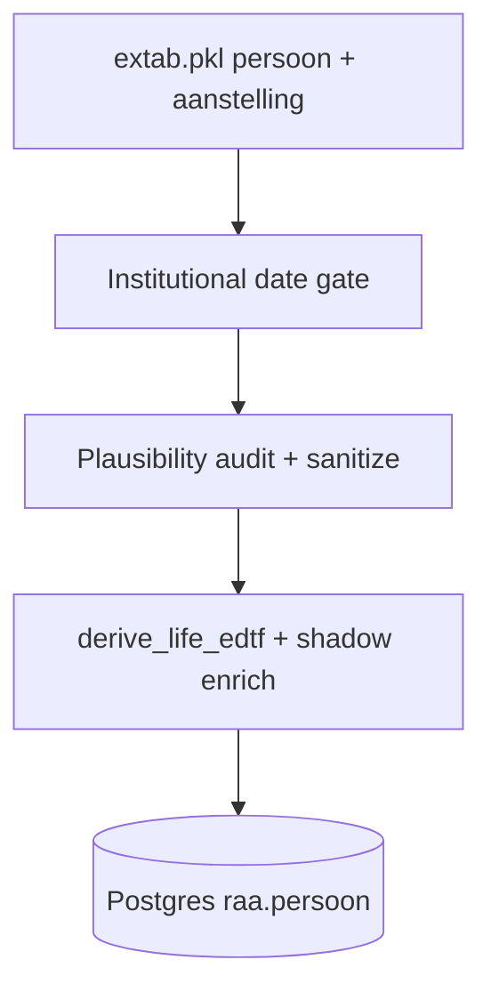

# Life dates — recorded, shadow, validation, and search

Reference for how person **geboorte** / **overlijden** are derived at import, stored in Postgres, shown in the UI, and used in search filters and overview charts.

**Code:** `raa_life_dates/` (`edtf.py`, `shadow.py`, `validate.py`, `institutional_gate.py`) · `scripts/import_release.py` · `web/api/raa_api/edtf_bounds.py` · `web/api/raa_api/search.py` · `web/ui/src/lib/search.ts` (`lifeCell`)

---

## 1. Pipeline at import

`import_release.py` enriches `persoon` **before** writing to Postgres. Order matters:



| Step | Module | What it does |
|------|--------|--------------|
| 1 | `institutional_gate.apply_institutional_date_gate` | Drop aanstelling without parseable `van`; drop persons with no dated appointment left; cascade `alias` / `bron_details` |
| 2 | `validate.audit_implausible_recorded_dates` | Log persons with out-of-range recorded years (console only) |
| 3 | `validate.sanitize_implausible_recorded_dates` | Clear source date fields when year ∉ [1400, 1920] or garbage (e.g. `0`, `10`) |
| 4 | `shadow.enrich_persoon_life_dates` | Derive EDTF strings, `geboorte_year` / `overlijden_year`, shadow `life_*` columns |

**Re-import** is required for DB rows to pick up gate, validation, or shadow rule changes. See [§8 Re-import workflow](#8-re-import-workflow).

---

## 2. Source fields (extab / legacy Zope)

Recorded dates live in legacy columns on `persoon`. They are **never overwritten** by shadow logic; shadow fills separate `life_*` columns only.

### Geboorte

| Column | Role |
|--------|------|
| `geboortedatum` | ISO date (`YYYY-MM-DD`); preferred when present |
| `geboortejaar`, `geboortemaand`, `geboortedag` | Partial date parts |
| `geboortedatum_als_bekend` | Human label shown in UI (e.g. `1767`, `ca. 1750`) |
| `onbepaaldgeboortedatum` | Truthy → approximate; EDTF gets `~` suffix |
| `doopjaar` | Display only: label becomes “gedoopt” instead of “geboren” |

### Overlijden

| Column | Role |
|--------|------|
| `overlijdensdatum` | ISO date |
| `overlijdensjaar`, `overlijdensmaand`, `overlijdensdag` | Partial parts |
| `overlijdensdatum_als_bekend` | Human label |
| `onbepaaldoverlijdensdatum` | Approximate flag |

**Parsing rule:** calendar years use `pd.Period(..., freq="D")`, not `pd.Timestamp`, so dates before 1678 remain valid.

---

## 3. Institutional date gate

RAA is **institution-first**: a person enters the corpus via a dated office (`aanstelling`).

- **Drop** any `aanstelling` row whose `van` does not parse to a calendar year.
- **Drop** any `persoon` with no remaining dated appointment.
- Orphan `alias` / `bron_details` rows for removed persons are dropped.

Consequences:

- Shadow birth (`min(van) − 34`) always has a dated anchor when the person is in the DB.
- Persons known only from undated references are excluded entirely (by design).

---

## 4. Plausibility validation

Legacy data sometimes contains garbage years (`0`, `10`, `2001`, pre-1400 values). Module: `raa_life_dates/validate.py`.

| Constant | Value | Rationale |
|----------|-------|-----------|
| `LIFE_YEAR_MIN` | **1400** | Corpus starts 1428; small margin for edge records |
| `LIFE_YEAR_MAX` | **1920** | Corpus ends 1861; margin for late life / dating noise |

**At import (sanitize):** if raw parsed geboorte or overlijden year is outside bounds, **all** source columns for that event are cleared (`geboortejaar`, `geboortedatum_als_bekend`, etc.). Counts are printed (`geboorte_cleared`, `overlijden_cleared`).

**At derive (`edtf.py`):** `_year_from_parts` and ISO parsing apply the same bounds — implausible years become `NULL` for `geboorte_year` / `overlijden_year`.

**At display (defensive, also before re-import):**

- API `format_persoon_life_summary` hides implausible `*_als_bekend` text.
- UI `lifeCell()` hides implausible display strings and falls back to shadow or `—`.

Audit only (no DB write):

```bash
uv run python -c "
import pickle; from pathlib import Path
from raa_life_dates.validate import audit_implausible_recorded_dates
extab = pickle.load(open(Path.home()/'develop/raa_convert/extab.pkl','rb'))
for r in audit_implausible_recorded_dates(extab['persoon'])[:20]:
    print(r)
"
```

---

## 5. Recorded EDTF derivation

`derive_life_edtf(row)` → `(geboorte_edtf, overlijden_edtf, geboorte_year, overlijden_year)`.

1. Try ISO column (`geboortedatum` / `overlijdensdatum`) → year + keep `*_als_bekend` as EDTF when ISO wins.
2. Else build from year/month/day parts; append `~` when `onbepaald*` is set.
3. Years outside [1400, 1920] → treated as **no recorded date**.

Stored on import:

| Column | Content |
|--------|---------|
| `geboorte_edtf`, `overlijden_edtf` | Level 1 EDTF string from **recorded** sources only |
| `geboorte_year`, `overlijden_year` | Integer year from recorded sources (NULL if absent/implausible) |

---

## 6. Shadow life dates

When recorded birth or death is missing, import infers **search bounds** from appointment spans (`aanstelling.van` / `aanstelling.tot`).

Per person, from dated appointments:

| Anchor | SQL-ish definition |
|--------|-------------------|
| `aanst_min_van_year` | `min(parseable van year)` |
| `aanst_max_tot_year` | `max(parseable tot year)` |

### Birth shadow

**Condition:** no valid `geboorte_year`.

```
life_start_year = aanst_min_van_year − 34
life_start_edtf   = "{life_start_year}~"
life_start_source = "shadow"
```

`BIRTH_OFFSET_YEARS = 34` (global v1; period/role-specific offsets deferred — see PLAN.md).

### Death shadow (current rules, 2026-08)

**No +22 padding.** Death shadow is **not** a claim that the person died in that year.

**Condition:** no valid `overlijden_year`, and `aanst_max_tot_year` is known.

| Field | Value | Meaning |
|-------|-------|---------|
| `life_end_year` | `aanst_max_tot_year` | **Search anchor** — last year with a dated `tot` on any appointment |
| `life_end_edtf` | `>{aanst_max_tot_year}` | **Display** — open interval after last office end (EDTF “greater than”) |
| `life_end_source` | `shadow` | Provenance badge (*geschat*) |

**Extra case:** if recorded death ≤ recorded birth but `aanst_max_tot_year` exists, shadow death replaces the inconsistent recorded end (same `tot` anchor).

**Skipped when:** no parseable `tot` on any appointment → no shadow death (`life_end_*` stay NULL).

### Effective life span columns

After enrichment, each person has:

| Column | Role |
|--------|------|
| `life_start_year` | `geboorte_year` or shadow birth |
| `life_end_year` | `overlijden_year` or shadow death anchor |
| `life_start_edtf`, `life_end_edtf` | EDTF for display/search metadata |
| `life_start_source`, `life_end_source` | `recorded` \| `shadow` \| `partial` \| NULL |

`partial` = recorded value present for one end but not the other without shadow fill on that end.

---

## 7. Display semantics (UI)

### Search result columns (`lifeCell`)

Priority:

1. **`geboortedatum_als_bekend` / `overlijdensdatum_als_bekend`** if present and plausibility check passes on leading year.
2. Else if `life_*_source === 'shadow'`:
   - **Birth:** show `life_start_year` (italic *geschat*).
   - **Death:** show `life_end_edtf` when it starts with `>` (e.g. `>1770`), not the bare year — signals “after last office”, not death year.
3. Else `—`.

### Detail page (`format_persoon_life_summary`)

Same plausibility guard on `*_als_bekend`. Uses “geboren” / “gedoopt” / “overleden” labels with optional “ca.” for approximate flags.

### What shadow death `>1770` means for users

> Last dated **end of office** in the database is 1770; the person may have lived longer. It is **not** “died in 1770”.

---

## 8. Re-import workflow

Import **replaces** Postgres tables (`if_exists="replace"`). While import runs, the API may return errors if it queries mid-replace.

### Recommended: stop, import, start

1. **Stop** the running dev stack — `Ctrl+C` in the terminal where `./scripts/dev.sh` is running (or stop whatever serves port 8000).
2. **Re-import and start API:**
   ```bash
   ./scripts/dev.sh --import
   ```
   This waits for Postgres, runs `uv run python scripts/import_release.py --skip-validate`, then starts uvicorn on `:8000`.

### Import only (no API)

```bash
./scripts/dev.sh --import-only
```

Use when Postgres is already up and you will start the API separately:

```bash
./scripts/dev.sh          # start API after import-only
```

### After import

- Hard-refresh the browser (UI reads live API; no separate cache invalidation).
- Console output shows gate drops, implausible-date clears, and row counts.

**Note:** `./scripts/dev.sh --import` does **not** stop an already-running API in another terminal — you must stop it yourself first or the new process will fail with “address already in use” on port 8000.

---

## 9. Search behavior

### Request shape

Personen search/summary use `SearchRequest`:

```json
{
  "q": "…",
  "filters": {
    "geboorte": ["1700/1750"],
    "overlijden": ["../1800"]
  },
  "include_shadow_dates": true,
  "period": "republiek",
  "period_mode": "filter"
}
```

| Field | Default | Meaning |
|-------|---------|---------|
| `include_shadow_dates` | `true` | Use shadow-filled year columns in filters and timeline |
| `filters.geboorte` | `[]` | List of EDTF interval strings (AND across list) |
| `filters.overlijden` | `[]` | Same for death |

UI: radio **“zoek exacte datums”** sets `include_shadow_dates: false` (`dateMode === 'exact'`).

### Which SQL column is filtered?

From `edtf_bounds._year_column`:

| Filter | `include_shadow_dates: true` (default) | `include_shadow_dates: false` (exact) |
|--------|----------------------------------------|---------------------------------------|
| `geboorte` | `COALESCE(p.geboorte_year, p.life_start_year)` | `p.geboorte_year` |
| `overlijden` | `COALESCE(p.overlijden_year, p.life_end_year)` | `p.overlijden_year` |

**Overlap semantics:** each filter is an inclusive year range overlap. Person matches if their effective year column is NOT NULL and falls within the parsed EDTF interval bounds.

Example: `geboorte: ["1700/1750"]` with shadow on → someone with only shadow birth 1720 matches; with exact on → they appear in **undated** counts instead.

### EDTF query syntax (Level 1 subset)

Parsed by `parse_edtf_interval` in `raa_life_dates/edtf.py`:

| Expression | Meaning | SQL effect |
|------------|---------|------------|
| `1720/1750` | Closed year interval | `col >= 1720 AND col <= 1750` |
| `1720/..` | From 1720 onward | `col >= 1720` |
| `../1720` | Up to 1720 | `col <= 1720` |
| `1720~` | Point (qualifier ignored for bounds) | `col >= 1720 AND col <= 1720` |
| `>1770` | Open after 1770 | `col >= 1770` (no upper bound) |

Qualifiers `~`, `?`, `%` on point years do not widen the numeric bounds in search.

### Endpoints using the same rules

| Endpoint | Life-date use |
|----------|----------------|
| `POST /api/search/personen` | `_life_date_clauses` in WHERE |
| `POST /api/search/personen/summary` | Same WHERE + birth-year **timeline** histogram |
| Overview UI | Summary timeline; click bar sets `geboorte` filter to `YYYY/YYYY` |

### Timeline / overview histogram

`_personen_timeline` buckets on the **same column** as geboorte filters:

- Shadow on → `COALESCE(p.geboorte_year, p.life_start_year)`
- Exact → `p.geboorte_year` only

`timeline_meta.undated` = count of matching persons with NULL on that column (e.g. shadow-only births excluded in exact mode).

Footnote copy (exact mode): *“N zonder expliciet vastgelegd geboortejaar (schattingen niet meegeteld).”*

### Life-span overlap (not used in default personen form)

`life_span_overlap_sql` exists for overlapping a query interval with `[life_start_year, life_end_year]` (full span). Current personen UI filters **birth** and **death** independently via `life_year_overlap_sql`, not full-span overlap.

---

## 10. Quick reference tables

### Provenance badges

| UI | `life_*_source` | Meaning |
|----|-----------------|---------|
| normal text | `recorded` | From legacy source fields |
| *geschat* / italic | `shadow` | Inferred from appointments |
| (mixed) | `partial` | One end recorded, other inferred or missing |

### Related tests

```bash
uv run pytest tests/test_life_dates.py tests/test_life_date_validate.py tests/test_institutional_gate.py -q
uv run pytest web/api/tests/test_edtf_bounds.py web/api/tests/test_summary.py -q
```

### Deferred (see PLAN.md)

- Period-specific birth offset (ME / Republiek / 19e eeuw)
- Role-specific offset (e.g. gedeputeerde −44)
- EDTF filters on aanstelling `van`/`tot`
- Upstream derivation in `raa_convert` (optional)

---

## 11. Decision register (changelog)

| Date | Change |
|------|--------|
| 2026-07-13 | B2b: shadow life + EDTF search API shipped |
| 2026-08 | Death shadow: `max(tot)` anchor; display `>{year}`; removed +22 padding |
| 2026-08 | Institutional gate: dated `van` required; persons without dated appointment dropped |
| 2026-08 | Plausibility validation [1400, 1920]; sanitize at import; display guards |

See also [MIGRATION_LOG.md](MIGRATION_LOG.md) D-39a, B2b notes.
