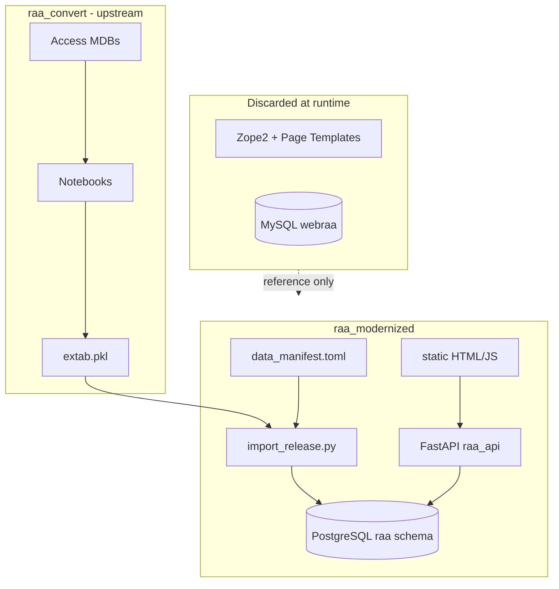

# RAA migration — decision register & implementation log

Chronological record of **why** the legacy Huygens RAA site was migrated this way, and **what** was built. For dev teams onboarding to `raa_modernized`, `dighum_web_template`, and the relationship to `raa_convert`.

**Related docs**

| Doc | Purpose |
|-----|---------|
| [PLAN.md](../PLAN.md) | Target architecture, phases, open work |
| [LEGACY-UX.md](../LEGACY-UX.md) | How the old Huygens UI worked (zoekhulp + source code) |
| [DATA.md](DATA.md) | Manifest tiers, `data_io` workflow |
| [dighum_web_template](file:///Users/rikhoekstra/develop/dighum_web_template) | Reusable web bootstrap (sibling repo) |

**Legacy reference**

- Live site: https://resources.huygens.knaw.nl/repertoriumambtsdragersambtenaren1428-1861/
- Zope app: `~/develop/RepertoriumAmbtenarenAmbtsdragers/src/raa/`
- Data pipeline: `~/develop/raa_convert/` → `extab.pkl`

---

## Decision register

Strategic choices, ordered by topic. Status: **decided** | **pilot** | **deferred** | **open**.

### Repository & template layout

| ID | Decision | Rationale | Status |
|----|----------|-----------|--------|
| D-01 | **Single monorepo** `raa_modernized` (pipeline + `web/`) | One git repo, shared manifest, simpler local dev; RAA-specific | **decided** |
| D-02 | **Sibling template** `dighum_web_template` (not inside `dighum_template`) | Keep pipeline template clean; web bootstrap is a derivative | **decided** |
| D-03 | Bootstrap via `bootstrap_web.sh --monorepo` | Creates pipeline root + `web/` in one target dir | **decided** |
| D-04 | `raa_convert` stays upstream conversion lab | Heavy MDB/notebook pipeline; web consumes `extab.pkl` only | **decided** |
| D-05 | Config in `config.local.toml` (monorepo) not cross-repo `bridge.toml` | Internal paths only when data and web share a repo | **decided** |

*Supersedes early plan option of separate `raa-data` + `raa-web` sibling repos.*

### Search store & API

| ID | Decision | Rationale | Status |
|----|----------|-----------|--------|
| D-10 | **PostgreSQL** for search pilot (not Elasticsearch v1) | ~22k persons / ~54k appointments; SQL facets sufficient; Phase 5 editorial needs Postgres anyway; simpler ops | **decided** (pilot) |
| D-11 | Defer ES unless Milestone B shows pain | Abstract `SearchBackend` planned; ES path documented in PLAN | **deferred** |
| D-12 | **FastAPI + SQLAlchemy 2 + raw SQL** for search queries | Direct port of legacy filter semantics; no ORM query builder yet | **pilot** |
| D-13 | Preserve legacy wildcard semantics (`*`, `?`, quoted phrases) | Historians expect same name-search behaviour as `query.py` | **decided** |
| D-14 | Four search contexts: personen, aanstellingen, instellingen, functies | Matches legacy `configure.zcml` and zoekhulp | **decided** |

*Milestone B gate (2026-07): 11/11 API checks passed, ~23ms latency — Postgres retained for pilot.*

### Period model

| ID | Decision | Rationale | Status |
|----|----------|-----------|--------|
| D-20 | **Top-level period selector** on all search pages | Legacy had no global period UI; modern addition to reduce facet clutter | **decided** |
| D-21 | Two modes: **period-scoped** (default) and **overall** (`Alle perioden`) | Scoped shrinks functie/instelling/suggest vocabs; overall for cross-period RQs | **decided** |
| D-22 | Period = boolean flags on rows (`republiek`, `batfra`, `negentiende_eeuw`, `me`) | Matches `raa_convert` / `CONVERSION_NOTES.md` | **decided** |
| D-23 | **`divperioden` rows purged on import** | Superseded by `republiek_friezen`; `mark_for_delete=1` when `divperioden==1` | **decided** |
| D-24 | **`republiek_friezen` merged into Republiek search** | Fries rows were **separately edited** in `raa_convert` (not a separate UI period); `republiek_friezen` flag kept in DB for provenance; search/suggest use `republiek OR republiek_friezen` | **decided** |

### UX & frontend

| ID | Decision | Rationale | Status |
|----|----------|-----------|--------|
| D-30 | **Static HTML/JS pilot** before SvelteKit | Faster Milestone B validation; PLAN still targets SvelteKit for Phase 3 | **pilot** |
| D-31 | Filter sets per context in `search_contexts.yaml` | Different RQs need different fields (zoekhulp: person vs institution perspective) | **decided** |
| D-32 | Typeahead suggest for high-cardinality fields | functie, instelling, geo — alphabetical, period-scoped | **decided** |
| D-33 | **Vertegenwoordiging** = provincie / regio / lokaal (3 columns) | Legacy `personen.pt` / `aanstellingen.pt`; see LEGACY-UX | **decided** (slice 1) |
| D-34 | Aanstellingen **nested grouping** (instelling → functie) | Legacy default result shape; nested UI with instelling/functie toggle | **decided** (2026-07-13) |
| D-35 | Person detail: bovenlokaal / namens split | Legacy `persoon.pt` + `vertegenwoordigend` flag | **decided** (2026-07-13) |
| D-36 | Functie/instelling **en/of** multi-select | Legacy `form.py`; chip pickers + `functie_match` / `instelling_match` | **decided** (2026-07-13) |
| D-37 | **Display name** when `geslachtsnaam` empty | 51 persons voornaam-only; avoid legacy `, Pieter` listing; `coalesce(geslachtsnaam, voornaam)` sort | **decided** (2026-07-13) |
| D-38 | **Shadow life dates** at import | ~11.5k persons lack birth date but have aanstellingen; port `hypothetical_life` from `republic_clean/.../datamangler.py` | **decided** (2026-07-13) |
| D-39 | **EDTF Level 1** life-date search (personen) | Partial/uncertain dates + interval overlap; [LOC EDTF](https://www.loc.gov/standards/datetime/); aanstellingen stay ISO in v1 | **decided** (2026-07-13) |

### Enhancements above legacy (modern-only)

| ID | Decision | Rationale | Status |
|----|----------|-----------|--------|
| D-38a | Shadow dates **included in search by default** | Better recall for life-date RQs; radio **“zoek exacte datums”** switches to recorded bounds only | **decided** (2026-07-13) |
| D-38b | Shadow offsets **34 yr birth / 22 yr death** (global v1) | Matches `datamangler.py` default; period- or role-specific offsets deferred | **decided** (2026-07-13) |
| D-39a | EDTF derived at **import** in `raa_modernized` | `geboorte_edtf` / `overlijden_edtf` + `life_*_year` bounds; extab unchanged | **decided** (2026-07-13) |
| D-55 | **Entity span** auxiliary tables at import | `functie_instelling_span` (primary) + `functie_attestation` (rollup); built from dated `aanstelling` rows; not in extab | **decided** (2026-07-13) |
| D-56 | Span labels = **database witnesses**, not office invention/abolition | Earliest/latest dated aanstelling only; same functienaam may appear in parallel or sequential institutional contexts | **decided** (2026-07-13) |
| D-57 | **No inferred ambtsketen** across contexts | Do not merge successor `instelling_id`s or fill gaps; UI shows separate context rows + explicit caveat; link to institutionele toelichting / zoekhulp | **decided** (2026-07-13) |
| D-59 | **Shadow `search_display`** on `persoon` | Legacy `searchable` is surname-skewed; identity search needs display naam + titels + alias + heerlijkheid + opmerkingen in one indexed blob (B2f) | **decided** (2026-07-14) |
| D-60 | **Hybrid search UI** (basic + facets) | Keep simple `q` search; add live facet sidebar with counts; advanced filters collapsed — not pure form, not facets-only | **decided** (2026-08-16) |

**D-56 note (institutional view paradox):** RAA was built and edited from an **institutional perspective**, yet the schema stores flat `instelling` rows without lineage between regime-specific successors. Discontinuities in span tables may therefore reflect **modelling/snapshot boundaries** (re-keying after 1795, separate edit tracks) as much as missing data — strange but expected until an explicit succession model exists.

**Open TODO (deferred):** tune shadow offsets per historical period (ME / Republiek / 19e eeuw) or office type (e.g. gedeputeerde −44 yr) — see Milestone B2 in [PLAN.md](../PLAN.md).

### Data import & ops

| ID | Decision | Rationale | Status |
|----|----------|-----------|--------|
| D-40 | Import `extab.pkl` → `raa.*` Postgres tables (`if_exists=replace`) | Full snapshot per import; editorial merge later (Phase 5) | **pilot** |
| D-41 | `--skip-validate` optional on import | `validate_export.py` can be slow; validation gate before production import | **decided** |
| D-42 | Local Postgres via `docker run` not compose | Docker compose plugin broken on dev machine during pilot | **pilot** (env-specific) |
| D-43 | `data_manifest.local.toml` for machine tier roots | `raa_extab` → `~/develop/raa_convert/extab.pkl` | **decided** |

### Editorial & deployment

| ID | Decision | Rationale | Status |
|----|----------|-----------|--------|
| D-50 | Phase 5: Postgres **editorial amendments** overlay | Edits without re-running `raa_convert`; merge on new releases | **deferred** |
| D-51 | v1 **read-only** public site | Auth + TinyMCE-style editing not in pilot | **deferred** |
| D-52 | Phase 4 deployment (managed Postgres + API + static) | Not started | **deferred** |
| D-53 | **Self-contained local dev** (`scripts/dev.sh`) | One entry point: compose Postgres + import-if-empty + API; replace ad-hoc `docker run` / split cwd steps once stack stabilizes | **decided** (2026-07-13) |
| D-54 | **Production API process:** Gunicorn + Uvicorn workers | FastAPI is ASGI; dev keeps `uvicorn --reload`; `./scripts/dev.sh --prod` or compose uses `gunicorn -k uvicorn.workers.UvicornWorker` | **pilot** (2026-07-13) |
| D-58 | **Legacy ID concordance** (Huygens → modern `raa.*.id`) | User has partial concordance; defer to backlog (B3f): auxiliary table at import + redirect/lookup; personen first | **backlog** (2026-07-14) |

### Explicit non-goals (v1)

- Zope/Five/SQLObject/MySQL runtime
- Legacy ETL in `RepertoriumAmbtenarenAmbtsdragers/src/scripts/`
- Bundled TinyMCE 2.x
- Elasticsearch in production (unless gate reopens)
- Observable dashboards (separate pattern)

---

## Architecture snapshot (as built)



---

## Implementation log (chronological)

Append new entries at the **top** (newest first). Format: `YYYY-MM-DD — title`.

### 2026-07-12 — Merge republiek_friezen into Republiek period

**Context**

In `raa_convert`, Fries/Republic data was **edited on a separate track** from the main Republiek export — hence the `republiek_friezen` column in `extab.pkl`. That is a **provenance/editorial split in the pipeline**, not a separate period for end users. Zoekhulp and the legacy Huygens UI also treat this as Republiek.

**Done**

- `_period_match_sql`: selecting **Republiek** matches `republiek = 1 OR republiek_friezen = 1` on search, suggest, and `/api/periods` counts.
- The `republiek_friezen` column **remains in Postgres** (not dropped, not a UI period option).
- Person count for Republiek: **8677** (7637 + 1040, no overlap).

**Notes**

- Fries appointments still use **lokaal/regio**, not `provincie_id` — Provinciaal suggest for "Friesland" may stay empty; use **Lokaal** (e.g. Leeuwarden).

---

### 2026-07-12 — Vertegenwoordiging filters + LEGACY-UX doc

**Done**

- Added [LEGACY-UX.md](../LEGACY-UX.md) (zoekhulp mapping, legacy code references, parity checklist).
- API: `provincie_id`, `regio_id`, `lokaal_id` filters on personen + aanstellingen search; suggest endpoints for all three geo dimensions.
- UI: three-column Vertegenwoordiging fieldset with typeahead + multi-select chips on personen and aanstellingen pages.
- `search_contexts.yaml`: vertegenwoordiging marked advanced.

**Verified**

- `lokaal_id=34` (Amsterdam) + Republiek: 410 personen vs 7637 unfiltered.
- Live `/api/suggest/lokaal` + POST search endpoints.

**Notes**

- Provincie suggest only lists values **linked in appointments** for the selected period (~30 rows in Republiek have `provincie_id`).

---

### 2026-07-12 — Validation pass & polish (Milestone B)

**Done**

- Fixed `STATIC` path in `main.py` (`parents[2]` → serves `web/frontend/static/`).
- Table-qualified SQL (`p.`, `a.`) to fix ambiguous `republiek` in facet queries.
- Personen: functie/instelling typeahead, `?person=` deep links.
- Aanstellingen: row click → person detail.
- README web run instructions.

**Verified**

- 11/11 API checks (wildcards, period modes, geo-related API paths, latency ~23ms).
- UI confirmed working after static path fix.

**Outstanding**

- Git commits staged but not pushed (user to commit locally).

---

### 2026-07-12 — divperioden purge on import

**Problem**

- `divperioden` period was a catch-all; Fries data now lives under `republiek_friezen` per `raa_convert/docs/CONVERSION_NOTES.md`.

**Done**

- `purge_divperioden()` in `import_release.py`: drop rows with `divperioden=1` on core tables; strip flag on shared lookups.
- Removed "Diverse Perioden" from period selector config.
- Re-import: 0 `divperioden=1` on core tables; 1040 `republiek_friezen` persons remain.

**Deferred**

- ~~Separate UI period for Fries~~ — merged into Republiek filter (2026-07-12).

---

### 2026-08-17 — Milestone E1: editorial amendments (instelling.toelichting)

**Done (first slice)**

- `editorial.amendments` schema + `scripts/init_editorial_schema.py`
- API: `raa_api/editorial.py`, API-key auth via `config.local.toml`, CORS for admin origin
- Public instelling detail: effective `toelichting` + `toelichting_amended`
- **`web/admin/`** — separate redactie app (:5174), not search UI clone
- **`web/shared/`** — shared fetch helpers
- Docs: [docs/EDITORIAL.md](EDITORIAL.md)

**Open:** E0 merge on re-import, E2–E4 field scope.

---

### 2026-08-17 — Life-date validation + documentation

**Done**

- `raa_life_dates/validate.py`: plausibility bounds [1400, 1920]; audit + sanitize at import; clears garbage years (`0`, `10`, etc.).
- `edtf.py`: reject implausible years at derive time; display guards in API + UI `lifeCell`.
- **docs/LIFE_DATES.md** — full reference: import pipeline, institutional gate, shadow birth/death rules, display vs search, EDTF filters, re-import workflow.

**Re-import**

Stop running `./scripts/dev.sh` (Ctrl+C), then `./scripts/dev.sh --import`. Use `--import-only` if you only want Postgres refreshed without starting the API.

---

### 2026-07-13 — Milestone B2b: shadow life dates + EDTF search API

**Done**

- Package `raa_life_dates/`: `edtf.py` (Level 1 derive + parse), `shadow.py` (`enrich_persoon_life_dates`, birth offset 34).
- `scripts/shadow_life.py` CLI; `import_release.py` enriches `persoon` before load.
- New `persoon` columns: `geboorte_edtf`, `overlijden_edtf`, `geboorte_year`, `overlijden_year`, `life_start_year`, `life_end_year`, `life_*_edtf`, `life_*_source`.
- API: `include_shadow_dates` on `SearchRequest` (default `true`); `filters.geboorte` / `filters.overlijden` accept EDTF intervals; `raa_api/edtf_bounds.py`.
- Indexes: `life_start_year`/`life_end_year`, `geboorte_year`.

**Verified** (extab.pkl, no DB)

- Shadow starts: 11,271; shadow ends: 8,860; life span on ~21.8k persons.
- `uv run pytest tests/test_life_dates.py` (6 passed).
- `uv run pytest tests/` in `web/api` (8 passed).

**Next**

- B2c UI: EDTF inputs + **“zoek exacte datums”** radio.
- Re-import Postgres when DB available.

---

### 2026-08-16 — C3: SvelteKit detail pages (themed)

**Done**

- Routes: `/personen/[id]`, `/instellingen/[id]`, `/functies/[id]` with archive-blue detail chrome.
- Search result links point at SvelteKit details (no longer only `/static/`).
- API profile hrefs updated to modern paths; client still rewrites legacy `/static/` HTML if present.

**Next:** C2b hybrid facets on other search contexts; polish deep-links into aanstellingen filters.

---

### 2026-08-16 — C2a: personen hybrid search (D-60)

**Done**

- Personen API facets expanded: stand, adel, functie, instelling, provincie, regio, lokaal (top 20, disjunctive per dimension).
- SvelteKit personen: basic naam search + results + **facet sidebar**; advanced filters in `<details>`; active filter chips.
- Template for C2b on other contexts.

**Next:** C2b hybrid on aanstellingen; then C3 detail pages.

---

### 2026-08-16 — C2: period + full filters in SvelteKit

**Done**

- Global period selector (scoped / Alle perioden) shared across contexts.
- **Personen:** naam, EDTF life dates, aanstellingsdatum, functie/instelling chips + en/of, geo chips, stand/adel, sort, pagination.
- **Aanstellingen:** same chips/geo/stand + van/tot, nested grouping, sort.
- **Instellingen / functies:** search + A–Z browse (period-scoped).
- Detail links still point at static pilot until C3.

---

### 2026-08-16 — C1: SvelteKit scaffold (`web/ui`)

**Done**

- New `web/ui/` SvelteKit app (adapter-static, Vite proxy to `:8000`).
- Routes: home entry, personen search stub, placeholders for other contexts.
- Static pilot remains at `web/frontend/static/` until C4.

**Next:** C2 — period selector + full filter parity.

---

### 2026-08-16 — B4b (partial): validation matrix + ID correction

**Done**

- Reworked [VALIDATION_RQS.md](VALIDATION_RQS.md): pilot capable on all RQs; X1–X5 marked PASS (automated / detail).
- **Corrected D-58 sample:** Huygens URL 6448 biography → pilot **21510** (was wrongly documented as 21009).
- Legacy **hit counts** still open (interactive Huygens forms); B3 formal close deferred.

**Decision**

Proceed to **Milestone C** (SvelteKit) while Legacy count cells can be filled asynchronously.

---

### 2026-08-16 — B4a + B4c: `dev.sh` harden + `make check`

**Done**

- **B4a:** `scripts/dev.sh` exports `DATABASE_URL`; falls back to legacy `raa_pg` when compose plugin missing; still supports `--import` / `--prod` / `stop`.
- **B4c:** root `Makefile` — `make check` (pytest root + web/api), `make smoke` / `make check-db` run `validation_rq_smoke.py --assert`.
- Smoke now asserts locked RQ baselines (P1/P2/P3/A1/I1/F1) and automates **X1–X5** against the pilot DB.

**Still open**

- **B4b** / B3 close: fill Huygens Legacy columns in VALIDATION_RQS.
- Start Postgres locally before `make check-db` (`docker start raa_pg` or `./scripts/dev.sh --db-only`).

---

### 2026-07-17 — B3d + B3e: aanstellingsdatum + A–Z browse

**Done**

- **B3d:** personen search filters `van`/`tot` → EXISTS appointment overlapping range; year-only (`1750`) or `YYYY-MM-DD`. Same year normalization on aanstellingen date filters.
- **B3e:** `GET /api/browse/{instellingen|functies}/az?letter=&period=` with letter counts; A–Z strip UI on instellingen + functies pages.
- Tests: year normalize + overlap clause; API smoke (Republiek `S` → 8 instellingen; personen 1750–1770 → 2841).

**Still open for B3 close gate**

- Human fill of Legacy/Verdict in [VALIDATION_RQS.md](VALIDATION_RQS.md).
- **B3f** ID concordance remains backlog (D-58).

---

### 2026-07-14 — B2f: shadow `search_display` (D-59)

**Done**

- Package `raa_search_display/`: shared name formatting + `enrich_persoon_search_display` (display naam, titles, aliases, heerlijkheid, opmerkingen, legacy `searchable`).
- Import writes `persoon.search_display` + index; search prefers that column (legacy per-field fallback if null).
- Backfill: `scripts/backfill_search_display.py` (ran on local pilot — 21k persons).
- Unblocks identity queries such as `Tjaerd baron van Aylva` (title token in opmerkingen).

**Verified**

- `uv run pytest tests/test_search_display.py`
- `uv run pytest tests/` in `web/api`

---

### 2026-07-14 — Legacy ID concordance → backlog (D-58)

**Context**

User has a concordance mapping legacy Huygens entity numbers to modern import IDs where applicable. **Legacy example IDs are not valid in the pilot** — primary keys come from `extab.pkl` (`/app/personen/6448` on Huygens ≠ `?person=6448` locally).

**Decision**

Defer to **B3f** backlog: auxiliary `legacy_id_map` table at import, personen first; optional redirect route. No implementation in current validation sprint.

**Known mapping (anchor for validation) — corrected 2026-08-16**

| Entity | Legacy (Huygens URL) | Modern (pilot) | Naam / note |
|--------|----------------------|----------------|-------------|
| persoon | [6448](https://resources.huygens.knaw.nl/repertoriumambtsdragersambtenaren1428-1861/app/personen/6448) | **21510** | Tjaerd baron van Aylva (1712–1757). Extab id 6448 is unrelated (Berger). |
| persoon | (earlier namesake) | **21009** | Tjaerd van Aylva (1644–1705) |

Pilot check: `http://127.0.0.1:8000/static/index.html?person=21510`

---


**Done**

- Pagination: vorige/volgende + range label on personen, aanstellingen, instellingen, functies (`PAGE_SIZE` 100).
- Personen: clickable sort on naam / geboorte / overlijden columns.
- Aanstellingen: sort dropdown (instelling, functie, van, life dates).
- Stand + adel: `filters.stand_id`, `filters.adel`; `GET /api/stands`; checkbox UI on personen + aanstellingen.

**Verified**

- `uv run pytest tests/` in `web/api`

---


**Done**

- [docs/VALIDATION_RQS.md](VALIDATION_RQS.md): 16 RQs (personen / aanstellingen / instellingen / functies) + 5 cross-cutting checks, pass criteria, outcomes → action table.
- `scripts/validation_rq_smoke.py`: pilot baseline counts for matrix seed rows.
- PLAN.md: B3 section + close gate.

**Next**

- Fill legacy counts and verdicts by running matrix against Huygens UI.
- Turn failures into B3 parity slices.

---


**Done (B2c)**

- Personen form: EDTF interval inputs (`geboorte`, `overlijden`); radio **zoek exacte datums** → `include_shadow_dates: false`.
- Listing + detail: provenance badges `~` (uncertain EDTF) and *geschat* (shadow life years).

**Done (B2e)**

- Package `raa_entity_spans/`: `build_functie_instelling_span`, `build_functie_attestation` at import.
- Tables `raa.functie_instelling_span`, `raa.functie_attestation`; indexes on `functie_id` / `instelling_id`.
- Functie / instelling detail profiles: corpus first/last witnesses, institutional context list with spans, D-57 caveat + zoekhulp link.

**Verified**

- `uv run pytest tests/test_entity_spans.py`
- `uv run pytest tests/` in `web/api`

**Note**

- Re-import Postgres (`uv run python scripts/import_release.py --skip-validate`) to create span tables.

---

### 2026-07-13 — Milestone B2a + B2d: display names + person/entity detail

**Done**

- `web/api/raa_api/display.py`: legacy `naam()` / listing name, life summary, heerlijkheid, opmerkingen HTML, shared `entity_profile()`.
- Person detail API: `display_naam`, `life_summary`, `heerlijkheid_line`, `opmerkingen_html`, `bronnen` (bron_details ⋈ bron), appointment `opmerkingen`; title joins on search + detail.
- Personen UI (`index.html`, `personen.js`): full detail sections; `listingPersonName` in results; `?functie_id=` deep link seeds functie chip.
- Functie / instelling detail: structured `profile` (stats, actions, related links, toelichting); `entity-detail.js` renderer + CSS.
- Tests: `web/api/tests/test_display.py` (6 cases).

**Verified**

- `uv run pytest tests/` in `web/api` (13 passed).

**Next**

- B2c UI: EDTF interval inputs + **“zoek exacte datums”** radio + provenance badges.

---


**Done**

- `scripts/dev.sh`: `docker compose` (Postgres) + import-if-empty + `uvicorn` from one command.
- Detects legacy `raa_pg` container name conflict and prints migration hint.

**Target** (when stack stabilizes)

- README documents `./scripts/dev.sh` as the only local path; retire manual multi-step / wrong-cwd workflows.
- **D-54:** API service in compose runs **Gunicorn** with `uvicorn.workers.UvicornWorker` (no `--reload`); dev.sh keeps uvicorn for iteration.

---

### 2026-07-13 — Names, shadow life dates, EDTF (planning)

**Context**

Planning session on three enhancements above the legacy Huygens app: persons without `geslachtsnaam`, life-date range search with uncertain/partial dates, and shadow life intervals inferred from aanstellingen (prior art: `~/develop/republic_clean/republic/data/datamangler.py` → `hypothetical_life()`).

**Decided** (D-37, D-38, D-39, D-38a/b, D-39a)

| Topic | Decision |
|-------|----------|
| No surname (51 rows) | Shared `display_name`: listing uses `voornaam` when `geslachtsnaam` empty; sort `coalesce(geslachtsnaam, voornaam)`; optional detail hint *alleen voornaam bekend* |
| Shadow life | Import-time `scripts/shadow_life.py`: `life_start_year`, `life_end_year`, `life_*_edtf`, `life_*_source` (`recorded` \| `shadow` \| `partial`); never overwrite source fields |
| Institutional gate | Import drops aanstelling without parseable `van`; drops persons with no dated appointment (`institutional_gate.py`) |
| Offsets v1 | Birth: `min(van).year − 34` when no geboorte; death: `>{max(van/tot).year}` when no overlijden (open after last appointment; **no +22 padding** since 2026-08) |
| Search default | Shadow **on**; UI radio **“zoek exacte datums”** → recorded bounds only |
| EDTF | Level 1 subset for personen filters (`1720/1750`, `../1720`, `1720~`, …); overlap against life interval; aanstellingen keep ISO date inputs in v1 |
| Storage | Derive EDTF + shadow columns in `import_release.py` / `shadow_life.py` (not in `raa_convert` extab) |

**Deferred / TODO**

- Period-specific or role-specific shadow offsets (34/22 global for now).
- Full personen filter set (alias, titels as separate fields).
- EDTF on aanstellingen zittingstermijn.

**Build track:** Milestone B2 in [PLAN.md](../PLAN.md) (B2a display name → B2b import + API → B2c UI).

---

### 2026-07-13 — Legacy UX parity slice 2 (en/of, grouping, person detail)

**Done**

- API: `functie_match` / `instelling_match` (`any`|`all`) on search requests; AND mode uses per-id `EXISTS` subqueries (legacy `query.py` semantics).
- Person detail: split `aanstellingen_lokaal` / `aanstellingen_bovenlokaal` with provincie/regio/lokaal/stand **namens** line; deep links to aanstellingen search.
- Aanstellingen UI: nested instelling → functie (default) or functie → instelling; chip multi-select + en/of on personen and aanstellingen.
- Instelling detail: functie list with links to pre-filtered aanstellingen search.
- UI page size raised to 100 (`PAGE_SIZE`).

**Verified**

- `uv run pytest tests/test_schemas.py` in `web/api` (4 passed).

**Deferred**

- Full personen filter set (alias, titels, date ranges as separate fields).
- Sort column toggles in UI.
- Sanitized `toelichting` HTML.

---

### 2026-07-12 — Four search contexts (API + static UI)

**Done**

- Endpoints: `/api/search/{personen,aanstellingen,instellingen,functies}`, detail routes, `/api/suggest/{field}`, `/api/periods`.
- HTML pages: `index.html`, `aanstellingen.html`, `instellingen.html`, `functies.html` + JS.
- Aanstellingen: `group_by` instelling/functie in API (aggregation mode); flat row mode default in UI.

---

### 2026-07-12 — Postgres import + person search pilot

**Done**

- Bootstrapped `raa_modernized` monorepo from `dighum_web_template`.
- `scripts/import_release.py`: 14 tables from `extab.pkl` into `raa` schema.
- FastAPI app with personen search, facets (period, stand), person detail (aliases, flat aanstellingen list).
- Local stack: Postgres 16 container `raa_pg`, uvicorn on :8000.

**Issues resolved**

| Issue | Fix |
|-------|-----|
| `bootstrap_web.sh` empty `FORWARD[@]` | Conditional array handling |
| Ambiguous SQL columns | Qualify with table alias |
| `VIRTUAL_ENV` mismatch | Project `.venv`; deactivate stale env |
| Docker compose plugin | `docker run` for Postgres |

---

### 2026-07-12 — Phase 0: `dighum_web_template` scaffold

**Done** (sibling repo `~/develop/dighum_web_template`)

- `scripts/bootstrap_web.sh` with `--monorepo` mode.
- `overlay/web-data/scripts/import_release.py` template (incl. `purge_divperioden` hook).
- `template/web-app/`: FastAPI stub, static frontend, `docker-compose.yml`, `search_contexts.yaml`.
- Pointer in `dighum_template` addons/README (web apps → sibling template).

**Bugfix**

- Bash `FORWARD[@]` unbound variable when no extra bootstrap args.

---

### 2026-07-12 — Planning decisions (pre-implementation)

**User choices** (from planning session)

1. Full **search/browse app** like legacy RAA (not Observable-only).
2. **Faceted search** + **period division** + **overall search** mode.
3. **Postgres vs Elasticsearch**: build abstract layer; **pilot Postgres**; decide after Milestone B.
4. Repo model evolved: two-repo → **`raa_modernized` monorepo** + **`dighum_web_template`** sibling.
5. **Option 1 build track**: template scaffold first, then RAA vertical slice.

**Plan artifact**

- Original plan: `dighum_template/docs/PLAN-raa-modernized.md` → copied to `raa_modernized/PLAN.md`.

---

## Parity matrix (legacy → modern)

| Legacy capability | Modern status | Log / decision |
|-------------------|---------------|----------------|
| Personen zoeken | Yes | D-14, D-30, D-36, D-59; naam via single `q` → `search_display` |
| Aanstellingen zoeken | Yes (barebones) | D-34, D-36; nested UI + en/of |
| Instellingen / functies browse | Yes | D-34; A–Z browse **B3e**; instelling detail → functie links |
| Period-scoped search | Yes | D-20, D-21 (modern addition) |
| Vertegenwoordiging | Yes | D-33; 2026-07-12 entry |
| en/of functie/instelling | Yes | D-36; 2026-07-13 |
| Wildcard name search | Yes | D-13 |
| Person detail bovenlokaal | Yes | D-35; 2026-07-13 |
| Person detail bronnen / opmerkingen / titels | Yes | B2d; 2026-07-13 |
| Functie / instelling entity profile | basic list | B2d; stats + related links; 2026-07-13 |
| Institutionele toelichting | Detail API; HTML unsanitized | D-51; B2d profile section |
| Stand / adel filters | Yes | D-36; **UI B3c** |
| Editorial toelichting edit | No | D-50 |
| Pagination 100/page | vorige/volgende + 100/page | B3a |
| Sort toggles | Yes | B3b |
| Display name (no geslachtsnaam) | — (legacy awkward comma) | D-37; **B2a shipped** |
| Shadow life-date search | — | D-38, D-38a; **API + UI shipped** (B2b, B2c) |
| EDTF life-date filters | — | D-39; **API + UI shipped** (B2b, B2c) |
| Functie institutional spans | — | D-55–D-57; **shipped** B2e |
| Shadow `search_display` | — | D-59; **shipped** B2f |

---

## How to extend this log

When you land a meaningful change, add a dated entry under **Implementation log** and update **Decision register** / **Parity matrix** if status changed.

Suggested entry template:

```markdown
### YYYY-MM-DD — Short title

**Done**
- …

**Verified**
- …

**Notes / deferred**
- …
```
