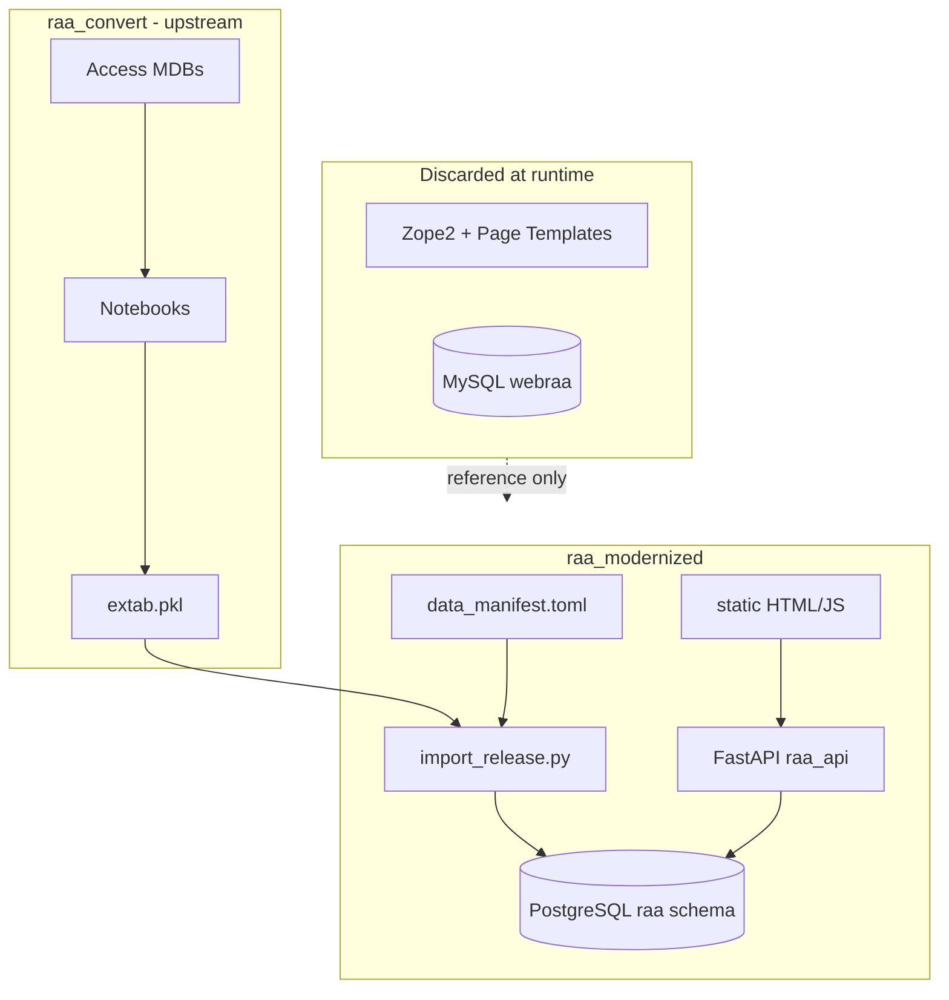

# RAA migration — decision register & implementation log

Chronological record of **why** the legacy Huygens RAA site was migrated this way, and **what** was built. For dev teams onboarding to `raa_modernized`, `dighum_web_template`, and the relationship to `raa_convert`.

**Related docs**

| Doc | Purpose |
|-----|---------|
| [PLAN.md](../PLAN.md) | Target architecture, phases, open work |
| [LEGACY-UX.md](../LEGACY-UX.md) | How the old Huygens UI worked (zoekhulp + source code) |
| [DATA.md](DATA.md) | Manifest tiers, `data_io` workflow |
| [dighum_web_template](file:///Users/rikhoekstra/develop/dighum_web_template) | Reusable web bootstrap (sibling repo) |

**Legacy reference**

- Live site: https://resources.huygens.knaw.nl/repertoriumambtsdragersambtenaren1428-1861/
- Zope app: `~/develop/RepertoriumAmbtenarenAmbtsdragers/src/raa/`
- Data pipeline: `~/develop/raa_convert/` → `extab.pkl`

---

## Decision register

Strategic choices, ordered by topic. Status: **decided** | **pilot** | **deferred** | **open**.

### Repository & template layout

| ID | Decision | Rationale | Status |
|----|----------|-----------|--------|
| D-01 | **Single monorepo** `raa_modernized` (pipeline + `web/`) | One git repo, shared manifest, simpler local dev; RAA-specific | **decided** |
| D-02 | **Sibling template** `dighum_web_template` (not inside `dighum_template`) | Keep pipeline template clean; web bootstrap is a derivative | **decided** |
| D-03 | Bootstrap via `bootstrap_web.sh --monorepo` | Creates pipeline root + `web/` in one target dir | **decided** |
| D-04 | `raa_convert` stays upstream conversion lab | Heavy MDB/notebook pipeline; web consumes `extab.pkl` only | **decided** |
| D-05 | Config in `config.local.toml` (monorepo) not cross-repo `bridge.toml` | Internal paths only when data and web share a repo | **decided** |

*Supersedes early plan option of separate `raa-data` + `raa-web` sibling repos.*

### Search store & API

| ID | Decision | Rationale | Status |
|----|----------|-----------|--------|
| D-10 | **PostgreSQL** for search pilot (not Elasticsearch v1) | ~22k persons / ~54k appointments; SQL facets sufficient; Phase 5 editorial needs Postgres anyway; simpler ops | **decided** (pilot) |
| D-11 | Defer ES unless Milestone B shows pain | Abstract `SearchBackend` planned; ES path documented in PLAN | **deferred** |
| D-12 | **FastAPI + SQLAlchemy 2 + raw SQL** for search queries | Direct port of legacy filter semantics; no ORM query builder yet | **pilot** |
| D-13 | Preserve legacy wildcard semantics (`*`, `?`, quoted phrases) | Historians expect same name-search behaviour as `query.py` | **decided** |
| D-14 | Four search contexts: personen, aanstellingen, instellingen, functies | Matches legacy `configure.zcml` and zoekhulp | **decided** |

*Milestone B gate (2026-07): 11/11 API checks passed, ~23ms latency — Postgres retained for pilot.*

### Period model

| ID | Decision | Rationale | Status |
|----|----------|-----------|--------|
| D-20 | **Top-level period selector** on all search pages | Legacy had no global period UI; modern addition to reduce facet clutter | **decided** |
| D-21 | Two modes: **period-scoped** (default) and **overall** (`Alle perioden`) | Scoped shrinks functie/instelling/suggest vocabs; overall for cross-period RQs | **decided** |
| D-22 | Period = boolean flags on rows (`republiek`, `batfra`, `negentiende_eeuw`, `me`) | Matches `raa_convert` / `CONVERSION_NOTES.md` | **decided** |
| D-23 | **`divperioden` rows purged on import** | Superseded by `republiek_friezen`; `mark_for_delete=1` when `divperioden==1` | **decided** |
| D-24 | **`republiek_friezen` merged into Republiek search** | Fries rows were **separately edited** in `raa_convert` (not a separate UI period); `republiek_friezen` flag kept in DB for provenance; search/suggest use `republiek OR republiek_friezen` | **decided** |

### UX & frontend

| ID | Decision | Rationale | Status |
|----|----------|-----------|--------|
| D-30 | **Static HTML/JS pilot** before SvelteKit | Faster Milestone B validation; PLAN still targets SvelteKit for Phase 3 | **pilot** |
| D-31 | Filter sets per context in `search_contexts.yaml` | Different RQs need different fields (zoekhulp: person vs institution perspective) | **decided** |
| D-32 | Typeahead suggest for high-cardinality fields | functie, instelling, geo — alphabetical, period-scoped | **decided** |
| D-33 | **Vertegenwoordiging** = provincie / regio / lokaal (3 columns) | Legacy `personen.pt` / `aanstellingen.pt`; see LEGACY-UX | **decided** (slice 1) |
| D-34 | Aanstellingen **nested grouping** (instelling → functie) | Legacy default result shape; API has `group_by`; UI still flat | **open** |
| D-35 | Person detail: bovenlokaal / namens split | Legacy `persoon.pt` + `vertegenwoordigend` flag | **open** |
| D-36 | Functie/instelling **en/of** multi-select | Legacy `form.py`; pilot = single typeahead only | **open** |

### Data import & ops

| ID | Decision | Rationale | Status |
|----|----------|-----------|--------|
| D-40 | Import `extab.pkl` → `raa.*` Postgres tables (`if_exists=replace`) | Full snapshot per import; editorial merge later (Phase 5) | **pilot** |
| D-41 | `--skip-validate` optional on import | `validate_export.py` can be slow; validation gate before production import | **decided** |
| D-42 | Local Postgres via `docker run` not compose | Docker compose plugin broken on dev machine during pilot | **pilot** (env-specific) |
| D-43 | `data_manifest.local.toml` for machine tier roots | `raa_extab` → `~/develop/raa_convert/extab.pkl` | **decided** |

### Editorial & deployment

| ID | Decision | Rationale | Status |
|----|----------|-----------|--------|
| D-50 | Phase 5: Postgres **editorial amendments** overlay | Edits without re-running `raa_convert`; merge on new releases | **deferred** |
| D-51 | v1 **read-only** public site | Auth + TinyMCE-style editing not in pilot | **deferred** |
| D-52 | Phase 4 deployment (managed Postgres + API + static) | Not started | **deferred** |

### Explicit non-goals (v1)

- Zope/Five/SQLObject/MySQL runtime
- Legacy ETL in `RepertoriumAmbtenarenAmbtsdragers/src/scripts/`
- Bundled TinyMCE 2.x
- Elasticsearch in production (unless gate reopens)
- Observable dashboards (separate pattern)

---

## Architecture snapshot (as built)



---

## Implementation log (chronological)

Append new entries at the **top** (newest first). Format: `YYYY-MM-DD — title`.

### 2026-07-12 — Merge republiek_friezen into Republiek period

**Context**

In `raa_convert`, Fries/Republic data was **edited on a separate track** from the main Republiek export — hence the `republiek_friezen` column in `extab.pkl`. That is a **provenance/editorial split in the pipeline**, not a separate period for end users. Zoekhulp and the legacy Huygens UI also treat this as Republiek.

**Done**

- `_period_match_sql`: selecting **Republiek** matches `republiek = 1 OR republiek_friezen = 1` on search, suggest, and `/api/periods` counts.
- The `republiek_friezen` column **remains in Postgres** (not dropped, not a UI period option).
- Person count for Republiek: **8677** (7637 + 1040, no overlap).

**Notes**

- Fries appointments still use **lokaal/regio**, not `provincie_id` — Provinciaal suggest for "Friesland" may stay empty; use **Lokaal** (e.g. Leeuwarden).

---

### 2026-07-12 — Vertegenwoordiging filters + LEGACY-UX doc

**Done**

- Added [LEGACY-UX.md](../LEGACY-UX.md) (zoekhulp mapping, legacy code references, parity checklist).
- API: `provincie_id`, `regio_id`, `lokaal_id` filters on personen + aanstellingen search; suggest endpoints for all three geo dimensions.
- UI: three-column Vertegenwoordiging fieldset with typeahead + multi-select chips on personen and aanstellingen pages.
- `search_contexts.yaml`: vertegenwoordiging marked advanced.

**Verified**

- `lokaal_id=34` (Amsterdam) + Republiek: 410 personen vs 7637 unfiltered.
- Live `/api/suggest/lokaal` + POST search endpoints.

**Notes**

- Provincie suggest only lists values **linked in appointments** for the selected period (~30 rows in Republiek have `provincie_id`).

---

### 2026-07-12 — Validation pass & polish (Milestone B)

**Done**

- Fixed `STATIC` path in `main.py` (`parents[2]` → serves `web/frontend/static/`).
- Table-qualified SQL (`p.`, `a.`) to fix ambiguous `republiek` in facet queries.
- Personen: functie/instelling typeahead, `?person=` deep links.
- Aanstellingen: row click → person detail.
- README web run instructions.

**Verified**

- 11/11 API checks (wildcards, period modes, geo-related API paths, latency ~23ms).
- UI confirmed working after static path fix.

**Outstanding**

- Git commits staged but not pushed (user to commit locally).

---

### 2026-07-12 — divperioden purge on import

**Problem**

- `divperioden` period was a catch-all; Fries data now lives under `republiek_friezen` per `raa_convert/docs/CONVERSION_NOTES.md`.

**Done**

- `purge_divperioden()` in `import_release.py`: drop rows with `divperioden=1` on core tables; strip flag on shared lookups.
- Removed "Diverse Perioden" from period selector config.
- Re-import: 0 `divperioden=1` on core tables; 1040 `republiek_friezen` persons remain.

**Deferred**

- ~~Separate UI period for Fries~~ — merged into Republiek filter (2026-07-12).

---

### 2026-07-12 — Four search contexts (API + static UI)

**Done**

- Endpoints: `/api/search/{personen,aanstellingen,instellingen,functies}`, detail routes, `/api/suggest/{field}`, `/api/periods`.
- HTML pages: `index.html`, `aanstellingen.html`, `instellingen.html`, `functies.html` + JS.
- Aanstellingen: `group_by` instelling/functie in API (aggregation mode); flat row mode default in UI.

---

### 2026-07-12 — Postgres import + person search pilot

**Done**

- Bootstrapped `raa_modernized` monorepo from `dighum_web_template`.
- `scripts/import_release.py`: 14 tables from `extab.pkl` into `raa` schema.
- FastAPI app with personen search, facets (period, stand), person detail (aliases, flat aanstellingen list).
- Local stack: Postgres 16 container `raa_pg`, uvicorn on :8000.

**Issues resolved**

| Issue | Fix |
|-------|-----|
| `bootstrap_web.sh` empty `FORWARD[@]` | Conditional array handling |
| Ambiguous SQL columns | Qualify with table alias |
| `VIRTUAL_ENV` mismatch | Project `.venv`; deactivate stale env |
| Docker compose plugin | `docker run` for Postgres |

---

### 2026-07-12 — Phase 0: `dighum_web_template` scaffold

**Done** (sibling repo `~/develop/dighum_web_template`)

- `scripts/bootstrap_web.sh` with `--monorepo` mode.
- `overlay/web-data/scripts/import_release.py` template (incl. `purge_divperioden` hook).
- `template/web-app/`: FastAPI stub, static frontend, `docker-compose.yml`, `search_contexts.yaml`.
- Pointer in `dighum_template` addons/README (web apps → sibling template).

**Bugfix**

- Bash `FORWARD[@]` unbound variable when no extra bootstrap args.

---

### 2026-07-12 — Planning decisions (pre-implementation)

**User choices** (from planning session)

1. Full **search/browse app** like legacy RAA (not Observable-only).
2. **Faceted search** + **period division** + **overall search** mode.
3. **Postgres vs Elasticsearch**: build abstract layer; **pilot Postgres**; decide after Milestone B.
4. Repo model evolved: two-repo → **`raa_modernized` monorepo** + **`dighum_web_template`** sibling.
5. **Option 1 build track**: template scaffold first, then RAA vertical slice.

**Plan artifact**

- Original plan: `dighum_template/docs/PLAN-raa-modernized.md` → copied to `raa_modernized/PLAN.md`.

---

## Parity matrix (legacy → modern)

| Legacy capability | Modern status | Log / decision |
|-------------------|---------------|----------------|
| Personen zoeken | Partial | D-14, D-30; naam via single `q` |
| Aanstellingen zoeken | Partial | D-34; flat UI |
| Instellingen / functies browse | Basic | Four contexts shipped |
| Period-scoped search | Yes | D-20, D-21 (modern addition) |
| Vertegenwoordiging | Yes | D-33; 2026-07-12 entry |
| Stand / adel filters | API facets only | D-36 |
| en/of functie/instelling | No | D-36 |
| Wildcard name search | Yes | D-13 |
| Person detail bovenlokaal | No | D-35 |
| Institutionele toelichting | Detail API; HTML unsanitized | D-51 |
| Editorial toelichting edit | No | D-50 |
| Pagination 100/page | API `size`≤100; UI uses 20 | open |
| Sort toggles | Partial `sort` param | open |

---

## How to extend this log

When you land a meaningful change, add a dated entry under **Implementation log** and update **Decision register** / **Parity matrix** if status changed.

Suggested entry template:

```markdown
### YYYY-MM-DD — Short title

**Done**
- …

**Verified**
- …

**Notes / deferred**
- …
```
