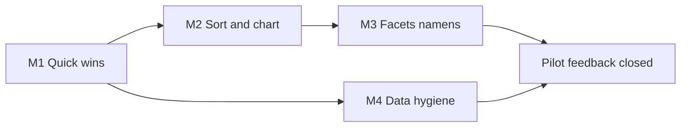

# RS feedback refinement plan

> **Source:** `CommentaarApplicatieRik_RS.txt` (2026-08)  
> **Status:** planned — not started  
> **Related:** [UI_REFINEMENT_PLAN.md](UI_REFINEMENT_PLAN.md) (Variant D, largely shipped), [SURF_DEMO.md](SURF_DEMO.md)

Historian feedback on the SURF/public pilot. This plan is the work queue. Product calls closed: **C2 lock**, **B3 listing+titles**, **D2 hybrid history** — see [Product calls](#product-calls).

## Why E2 is not L

RS: Staten-Generaal appears under two names (Friezen vs rest). That is a **data error**, not a UI merge.

**Work:** pick one canonical `instelling` row → re-point `aanstelling.instelling_id` (and any other FKs) → drop or archive the duplicate. No period-conditional logic beyond verifying both IDs and a post-merge search.

**Revised effort:** **S–M** (~2–4 h + re-import/restore check), not L.

---

## Effort legend

| Tag      | Meaning                            |
| -------- | ---------------------------------- |
| **S**    | ~0.5–2 hours                       |
| **M**    | ~0.5–1.5 days                      |
| **L**    | ~2–5 days                          |
| **done** | Already fixed (may be uncommitted) |

---

## Item register

| ID  | Remark (short)                                             | Layer           | Effort                         | Milestone    |
| --- | ---------------------------------------------------------- | --------------- | ------------------------------ | ------------ |
| A1  | Homepage “context” → clearer “vier ingangen”               | UI copy         | S                              | **done** M1  |
| A2  | Nav order: Personen, Instellingen, Functies, Aanstellingen | UI              | S                              | **done** M1  |
| A3  | “Facetten” → “Verfijnen”                                   | UI copy         | S                              | **done** M1  |
| A4  | Placeholder burgemeester → gedeputeerde                    | UI              | S                              | **done** M1  |
| A5  | Caveat “onderbrekingen…” clearer Dutch                     | UI/API copy     | S                              | **done** M1  |
| A6  | Uncertainty: EDTF-style (not bare `~`)                     | Display         | S–M                            | M1           |
| B1  | Personen (via instelling): default chronological           | UI/API sort     | S–M                            | M2           |
| B2  | Sort on aanstellingen                                      | UI/API          | **done** (local `van` default) | M2           |
| B3  | A–Z / listing: `achternaam, voornaam` + titles (cache)     | Display         | S–M                            | M1 **ok**    |
| B4  | Instelling “functies”: alpha not chrono                    | API detail      | S                              | **done** M1  |
| B5  | Show adel in result rows                                   | UI              | S–M                            | M1           |
| B6  | Histogram startjaar: year labels on axis                   | UI chart        | S–M                            | M2           |
| C1  | Hide **any** facet with count 0 in current period          | API/UI facets   | M                              | M3           |
| C2  | Verfijnen from instelling must not free-switch instelling  | UX              | M                              | M3 **lock**  |
| C3  | Provincie in vertegenwoordiging filters                    | Facets/filters  | M                              | M3           |
| C4  | Namens: stacked levels (prov → regio → lokaal)             | Display         | M                              | M3           |
| C5  | Warmolt Ackema / RvS namens Groningen                      | Data+display    | M                              | M3           |
| D1  | Inleiding link from home + all pages                       | UI              | S–M                            | M1           |
| D2  | Back / history after filters                               | Nav             | M                              | **C hybrid** |
| D3  | Toelichting footnote → previous screen                     | UI HTML anchors | S–M                            | M1           |
| E1  | Span years like 2031 (garbage)                             | Pipeline/import | M                              | M4           |
| E2  | Merge duplicate Staten-Generaal at import/source           | Data/import     | **S–M**                        | M4           |

---

## Milestones

### M1 — Quick wins (copy, chrome, visible adel)

**Goal:** Trust and orientation without deep filter work.  
**Effort:** ~2 days.

| Include                           | Checks    |
| --------------------------------- | --------- |
| A1–A6, A2, A3, B3, B4, B5, D1, D3 | See below |

**Checks (M1 close gate)**

- [ ] Homepage lede no longer says “kies een context”; mentions four entry points
- [ ] Top nav order: Personen → Instellingen → Functies → Aanstellingen
- [ ] No user-facing “facetten” where we mean refine (overzicht / home)
- [ ] Functies placeholder example finds hits in Republiek (e.g. gedeputeerde)
- [ ] Span caveat readable without jargon
- [ ] Uncertain life dates use EDTF-oriented wording/markers (document convention in LIFE_DATES or UI hint)
- [ ] Browse/listing names prefer `Geslachtsnaam, voornaam` + titles (`listing_naam` cache)
- [ ] Instelling detail “Functies in deze instelling” sorted A–Z by functie naam
- [ ] Adel filter on → rows show adel indicator
- [ ] Inleiding reachable from homepage and global chrome
- [ ] Clicking a footnote in institutionele toelichting scrolls to note (does not navigate away)

### M2 — Sort & timeline chart

**Goal:** Chronology readable in lists and histogram.  
**Effort:** ~0.5–1.5 days.

| Include | Notes                                                          |
| ------- | -------------------------------------------------------------- |
| B1      | Default chronological where RS meant “personen bij instelling” |
| B2      | Commit/push existing `van` default if not on SURF              |
| B6      | Year (or decade) labels under startjaar histogram              |

**Checks (M2 close gate)**

- [ ] Aanstellingen default sort = `van` (undated last); SURF build updated if demo still live
- [ ] Histogram axis shows years; bar ↔ year readable without hover-only
- [ ] Smoke: empty search / period Republiek → first page ordered by appointment start

### M3 — Facets & vertegenwoordiging (“namens”)

**Goal:** Period-true filters; multi-level namens.  
**Effort:** ~3–4 days.

| Include | Notes                                                                |
| ------- | -------------------------------------------------------------------- |
| C1      | **All** facets: hide (or omit) zero-count values for current period  |
| C3–C5   | Provincie filter + stacked namens display; Ackema as regression case |

**Checks (M3 close gate)**

- [ ] Republiek: no zero-count stand/adel (or other) facet chips cluttering refine
- [ ] Switching period changes which facet values appear
- [ ] Provincie available under vertegenwoordiging when data has `provincie_id`
- [ ] Result/detail “namens” can show provincie + regio + lokaal when set
- [ ] **Regression:** Warmolt Ackema, aanstelling RvS → Groningen visible in namens/provincie

**C2:** **lock** + Ontgrendel — confirmed. Implement with M3.

### M4 — Data hygiene

**Goal:** Spans and institution identity trustworthy.  
**Effort:** ~1–2 days (E2 alone is short).

| Include | Notes                                                                                                                                         |
| ------- | --------------------------------------------------------------------------------------------------------------------------------------------- |
| E1      | Sanitize impossible span/appointment years (e.g. 2031); recompute spans                                                                       |
| E2      | Canonical Staten-Generaal: merge duplicate instelling + rewrite `aanstelling.instelling_id` (+ related FKs); run at import or one-shot script |

**Checks (M4 close gate)**

- [ ] Admiraliteit Friesland (or reported case): no 2031 as laatste gedateerde aanstelling
- [ ] `SELECT` / search: one Staten-Generaal Republiek label for former Friezen+NL split
- [ ] Hit counts for Staten-Generaal search stable after merge (document before/after)
- [ ] Re-import or dump restore path documented if merge is import-time

**D2:** hybrid (C) — personen + aanstellingen; see [Product calls](#product-calls).

---

## Suggested order of work

M4 can run **in parallel** with M2/M3 (data vs UI).

**Pilot slice:** M1 + M2 + C1 from M3 + M4 ≈ **4–6 person-days**; add D2 hybrid when ready (~0.5–1.5 day).

---

## Product calls

| #   | ID     | Decision                                                             | Notes                                    |
| --- | ------ | -------------------------------------------------------------------- | ---------------------------------------- |
| 1   | **C2** | **Lock** + unlock control                                            | Confirmed 2026-08-21                     |
| 2   | **B3** | `**achternaam, voornaam` + titles**, ~72 chars, cache `listing_naam` | Confirmed 2026-08-21 (format as drafted) |
| 3   | **D2** | **Hybrid (C)** — personen + aanstellingen                            | Confirmed 2026-08-21                     |

### 1 — C2 Lock instelling — **confirmed**

Lock the instelling chip when opening refine from instelling detail; provide explicit **Ontgrendel**. Implement with M3.

### 2 — B3 Listing name + titles — **confirmed**

Ship as drafted: surname-first + titles, ~72-char truncate (cut voornaam first), cache column `persoon.listing_naam`, detail keeps full `display_naam`. Title order: acad → voornaam → adel → tussenvoegsel; head `Geslachtsnaam, …` (tussenvoegsel at end).

### 3 — D2 Back / history — **confirmed: hybrid (C)**

**Decision:** `replaceState` while refining rapidly; `pushState` when the result set settles (debounce ~600ms idle and/or explicit Zoeken / clear-filters milestones). Apply to **personen and aanstellingen together**. Short hint under results optional (“Back gaat naar de vorige zoekstap”).

**Not doing:** document-only (A), push every click (B), in-app-only undo (D), or hijacking Back (E).

**Today’s gap:** list URLs use `replaceState` only → Back leaves the search instead of undoing the last refine. Detail → Back already restores the current list URL.

**Implement when:** dedicated nav slice (after M1/M2 or alongside M3); touch `commitListState` on personen and the aanstellingen equivalent.

---

## Out of scope here

- Editorial/redactie SURF auth (config already documented)
- Milestone D production hardening
- Full ES search

---

## Changelog

| Date       | Change                                                                           |
| ---------- | -------------------------------------------------------------------------------- |
| 2026-08-20 | Initial plan from RS comments; E2 revised S–M (merge + FK rewrite)               |
| 2026-08-20 | Shipped pure-S items: A1–A5, B4                                                  |
| 2026-08-21 | Product calls: C2 lean lock + downsides; B3 listing+titles examples; D2 deferred |
| 2026-08-21 | C2 + B3 confirmed; D2 opened for discussion (replaceState vs hybrid push)        |
| 2026-08-21 | D2 confirmed: hybrid pushState (C), personen + aanstellingen                     |

