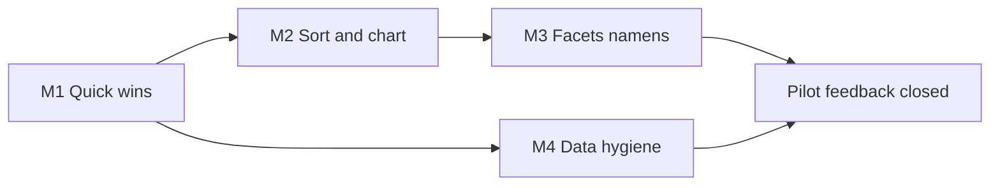

# RS feedback refinement plan

> **Source:** `CommentaarApplicatieRik_RS.txt` (2026-08)  
> **Status:** planned — not started  
> **Related:** [UI_REFINEMENT_PLAN.md](UI_REFINEMENT_PLAN.md) (Variant D, largely shipped), [SURF_DEMO.md](SURF_DEMO.md)

Historian feedback on the SURF/public pilot. This plan is the work queue; product calls (refine lock, name-order scope, back-button strategy) are **parked** until answered.

## Why E2 is not L

RS: Staten-Generaal appears under two names (Friezen vs rest). That is a **data error**, not a UI merge.

**Work:** pick one canonical `instelling` row → re-point `aanstelling.instelling_id` (and any other FKs) → drop or archive the duplicate. No period-conditional logic beyond verifying both IDs and a post-merge search.

**Revised effort:** **S–M** (~2–4 h + re-import/restore check), not L.

---

## Effort legend

| Tag | Meaning |
|-----|---------|
| **S** | ~0.5–2 hours |
| **M** | ~0.5–1.5 days |
| **L** | ~2–5 days |
| **done** | Already fixed (may be uncommitted) |

---

## Item register

| ID | Remark (short) | Layer | Effort | Milestone |
|----|----------------|-------|--------|-----------|
| A1 | Homepage “context” → clearer “vier ingangen” | UI copy | S | **done** M1 |
| A2 | Nav order: Personen, Instellingen, Functies, Aanstellingen | UI | S | **done** M1 |
| A3 | “Facetten” → “Verfijnen” | UI copy | S | **done** M1 |
| A4 | Placeholder burgemeester → gedeputeerde | UI | S | **done** M1 |
| A5 | Caveat “onderbrekingen…” clearer Dutch | UI/API copy | S | **done** M1 |
| A6 | Uncertainty: EDTF-style (not bare `~`) | Display | S–M | M1 |
| B1 | Personen (via instelling): default chronological | UI/API sort | S–M | **done** M2 (aanstellingen default `van`) |
| B2 | Sort on aanstellingen | UI/API | **done** | M2 |
| B3 | A–Z / listing: `achternaam, voornaam` | Display | S–M | M1 |
| B4 | Instelling “functies”: alpha not chrono | API detail | S | **done** M1 |
| B5 | Show adel in result rows | UI | S–M | M1 |
| B6 | Histogram startjaar: year labels on axis | UI chart | S–M | **done** M2 |
| C1 | Hide **any** facet with count 0 in current period | API/UI facets | M | M3 |
| C2 | Verfijnen from instelling must not free-switch instelling | UX | M | *parked* |
| C3 | Provincie in vertegenwoordiging filters | Facets/filters | M | M3 |
| C4 | Namens: stacked levels (prov → regio → lokaal) | Display | M | M3 |
| C5 | Warmolt Ackema / RvS namens Groningen | Data+display | M | M3 |
| D1 | Inleiding link from home + all pages | UI | S–M | M1 |
| D2 | Back / history after filters | Nav | M–L | *parked* |
| D3 | Toelichting footnote → previous screen | UI HTML anchors | S–M | M1 |
| E1 | Span years like 2031 (garbage) | Pipeline/import | M | M4 |
| E2 | Merge duplicate Staten-Generaal at import/source | Data/import | **S–M** | M4 |

---

## Milestones

### M1 — Quick wins (copy, chrome, visible adel)

**Goal:** Trust and orientation without deep filter work.  
**Effort:** ~2 days.

| Include | Checks |
|---------|--------|
| A1–A6, A2, A3, B3, B4, B5, D1, D3 | See below |

**Checks (M1 close gate)**

- [x] Homepage lede no longer says “kies een context”; mentions four entry points
- [x] Top nav order: Personen → Instellingen → Functies → Aanstellingen
- [x] No user-facing “facetten” where we mean refine (overzicht / home)
- [x] Functies placeholder example finds hits in Republiek (e.g. gedeputeerde)
- [x] Span caveat readable without jargon
- [ ] Uncertain life dates use EDTF-oriented wording/markers (document convention in LIFE_DATES or UI hint)
- [ ] Browse/listing names prefer `Geslachtsnaam, voornaam` (confirm detail header separately if product call open)
- [x] Instelling detail “Functies in deze instelling” sorted A–Z by functie naam
- [ ] Adel filter on → rows show adel indicator
- [ ] Inleiding reachable from homepage and global chrome
- [ ] Clicking a footnote in institutionele toelichting scrolls to note (does not navigate away)

### M2 — Sort & timeline chart

**Goal:** Chronology readable in lists and histogram.  
**Effort:** ~0.5–1.5 days.

| Include | Notes |
|---------|--------|
| B1 | Covered by aanstellingen default sort `van` (nested instelling → persoon rows chronological) |
| B2 | Default `van` in UI + API fallback |
| B6 | Compact histogram showed no labels (`!compact`); now shows thinned year ticks |

**Checks (M2 close gate)**

- [x] Aanstellingen default sort = `van` (undated last); SURF build updated if demo still live
- [x] Histogram axis shows years; bar ↔ year readable without hover-only
- [ ] Smoke: empty search / period Republiek → first page ordered by appointment start (manual)
### M3 — Facets & vertegenwoordiging (“namens”)

**Goal:** Period-true filters; multi-level namens.  
**Effort:** ~3–4 days.

| Include | Notes |
|---------|--------|
| C1 | **All** facets: hide (or omit) zero-count values for current period |
| C3–C5 | Provincie filter + stacked namens display; Ackema as regression case |

**Checks (M3 close gate)**

- [ ] Republiek: no zero-count stand/adel (or other) facet chips cluttering refine
- [ ] Switching period changes which facet values appear
- [ ] Provincie available under vertegenwoordiging when data has `provincie_id`
- [ ] Result/detail “namens” can show provincie + regio + lokaal when set
- [ ] **Regression:** Warmolt Ackema, aanstelling RvS → Groningen visible in namens/provincie

**Parked until product call:** C2 (lock instelling when refining from detail).

### M4 — Data hygiene

**Goal:** Spans and institution identity trustworthy.  
**Effort:** ~1–2 days (E2 alone is short).

| Include | Notes |
|---------|--------|
| E1 | Sanitize impossible span/appointment years (e.g. 2031); recompute spans |
| E2 | Canonical Staten-Generaal: merge duplicate instelling + rewrite `aanstelling.instelling_id` (+ related FKs); run at import or one-shot script |

**Checks (M4 close gate)**

- [ ] Admiraliteit Friesland (or reported case): no 2031 as laatste gedateerde aanstelling
- [ ] `SELECT` / search: one Staten-Generaal Republiek label for former Friezen+NL split
- [ ] Hit counts for Staten-Generaal search stable after merge (document before/after)
- [ ] Re-import or dump restore path documented if merge is import-time

**Parked:** D2 (browser back) until product call.

---

## Suggested order of work

M4 can run **in parallel** with M2/M3 (data vs UI).

**Pilot slice without waiting on product calls:** M1 + M2 + C1 from M3 + M4 ≈ **4–6 person-days**.

---

## Product calls (parked)

Answer later; do not block M1/M2/M4:

1. **C2** — Lock instelling when opening refine from instelling context, or allow free re-search?
2. **B3** — Surname-first listing only, or also detail titles?
3. **D2** — Invest in URL history / pushState, or document “use browser carefully / open new tab”?

---

## Out of scope here

- Editorial/redactie SURF auth (config already documented)
- Milestone D production hardening
- Full ES search

---

## Changelog

| Date | Change |
|------|--------|
| 2026-08-20 | Initial plan from RS comments; E2 revised S–M (merge + FK rewrite) |
| 2026-08-20 | Shipped pure-S items: A1–A5, B4 |
| 2026-08-20 | M2: B6 compact year labels; B1/B2 via `van` default |
